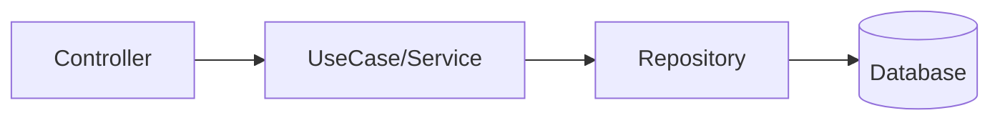

# Rule: Staff Engineer Review (SER)

## Context

During code review, the analysis must go beyond code quality. A Staff Engineer-level review evaluates design, architecture, scalability, and operational risks. This rule ensures reviews cover the dimensions that determine long-term system health.

This rule operates alongside `backend-anti-patterns.md` and `backend-security-review.md`. When rules conflict, the strictest restriction wins.

---

# Review Dimensions

During any code review, the system MUST evaluate the following dimensions in priority order:

1. 🏗️ Architecture
2. 🎯 Domain Design
3. 📈 Scalability
4. 🛡️ Reliability
5. 🔍 Observability
6. 🧪 Testability

---

## 1️⃣ Architecture

Verify the code respects system layer boundaries.

Expected architecture:

Architectural problems include:

- controller accessing repository
- domain depending on ORM
- services with multiple responsibilities
- circular dependencies
- business logic in controllers

Fundamental question:

> Does this implementation maintain clear separation between layers?

---

## 2️⃣ Domain Design

Evaluate if business rules are correctly modeled.

Check for:

- business rules scattered across layers
- duplicated logic
- anemic entities
- unprotected invariants

Fundamental question:

> Is the business rule in the correct place?

---

## 3️⃣ Scalability

Evaluate the implementation's impact in production.

Check for:

- N+1 queries
- queries without index
- queries loading unnecessary data
- heavy synchronous processing
- sequential async loops

Fundamental question:

> Will this code work well with 10x more data?

---

## 4️⃣ Reliability

Evaluate system resilience.

Check for:

- missing error handling
- retry on external calls
- missing timeouts
- data inconsistency
- absence of transactions

Fundamental question:

> What happens if something fails here?

---

## 5️⃣ Observability

Evaluate if the system is operable in production.

Check for:

- structured logs
- missing logs in critical flows
- generic error messages
- difficulty of diagnosis

Fundamental question:

> Will we be able to debug this in production?

---

## 6️⃣ Testability

Verify how easy it is to test the code.

Common problems:

- concrete dependencies
- logic in controllers
- missing interfaces
- lack of mocks

Fundamental question:

> Can we test this module in isolation?

---

# Finding Classification

During review, classify findings in three categories:

| Severity     | Criteria                               |
| ------------ | -------------------------------------- |
| 🔴 Critical  | Risk of bug, failure, or vulnerability |
| 🟡 Important | Impact on architecture or maintenance  |
| 💡 Suggestion| Structural improvement                 |

---

# Advanced Heuristics

Always look for:

### Excessive coupling

Example: service depending on multiple repositories

### Low cohesion

Example: function executing multiple responsibilities

### Boundary violation

Example: infrastructure accessing domain rules

### Unnecessary complexity

Example: abstractions without need

---

# Guiding Questions

During review, the system must mentally evaluate:

1. Is this implementation the **simplest possible**?
2. Will this code be **easy to maintain a year from now**?
3. Are there **unhandled edge cases**?
4. Does this code **scale with more data or traffic**?
5. Does the architecture remain **coherent** after this change?

---

# Hard Execution Gate

The system MUST NOT:

- Ignore architectural violations (controller → repository)
- Approve code without error handling for async operations
- Ignore N+1 queries or in-memory filters
- Skip observability concerns in critical flows

The system MUST:

- Flag every architectural violation
- Generate an architecture-level comment when coupling is detected
- Suggest moving logic to the correct layer

---

# Integration with Other Rules

This rule operates together with:

- `rules/backend-anti-patterns.md` — specific anti-pattern detection
- `rules/backend-security-review.md` — security vulnerability detection

Use comment templates from:

- `skills/backend-code-review/references/comment-templates.md`

---

## Security Principle

Architecture is not optional.

Correct layer > convenience.
Explicit boundary > implicit coupling.
Testable > clever.