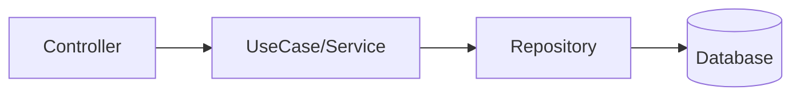

# Review Rules — Backend

Target projects:

- Node.js
- TypeScript
- Express
- TypeORM
- MySQL
- Clean Architecture
- tsyringe (DI)
- Jest

---

# Expected Architecture

Dependency flow:

Rules:

- Controllers must not access database directly
- Use cases must not know about Express
- Repositories must not contain business logic

---

# 🔴 Critical Problems

## Security

- Manually concatenated SQL
- Sensitive data in logs
- Missing input validation
- Bypassable authentication

---

## Data Consistency

- Multiple operations without transaction
- Race conditions

---

## Bugs

- Promise without await
- Missing error handling
- Incorrect business rules

---

## Architecture

- Controller calling repository
- Domain importing infrastructure
- Circular dependency

---

# 🟡 Important Problems

## Performance

- N+1 queries
- In-memory filters
- Missing pagination

---

## Code

- Large functions
- Duplicated logic
- Missing DTO

---

## Tests

- Use case without test
- Tests depending on real database
- Missing mocks

---

# 🟢 Improvements

- Structured logs
- Error standardization (`AppError`)
- Consistent naming