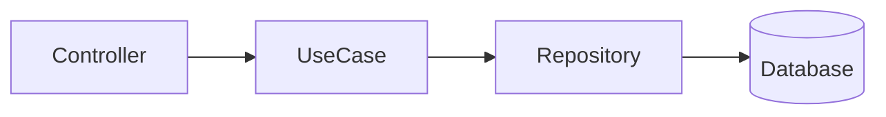
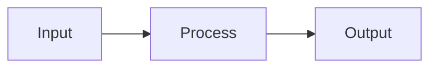
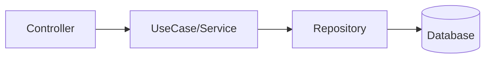

# AGENTS.md — AI Configs

This repository contains **AI agent configuration rules** for the organization's coding workflow. It is a meta-repository used by OpenCode and Cursor AI assistants.

---

## 1. Project Overview

This repo provides:
- **OpenCode rules**: Git governance, Technical Design Phase (TDP), release workflows
- **Cursor rules**: Backend code review, security analysis, anti-pattern detection
- **Skills**: Automated MR review with Jira integration

### Tech Stack (Target Projects)
- Node.js / TypeScript
- Express
- TypeORM / MySQL
- Clean Architecture
- tsyringe (DI)
- Jest (testing)

---

## 2. Build/Lint/Test Commands

This meta-repository has no build/test commands as it contains only markdown configuration files.

For target backend projects, common commands are:
```bash
npm run build        # Compile TypeScript
npm run lint         # ESLint check
npm run lint:fix     # Auto-fix linting issues
npm test             # Run Jest tests
npm test -- --testNamePattern="test name"  # Run single test
npm run migration:run  # Run TypeORM migrations
```

---

## 3. Git Workflow & Branching

### Branch Naming (Strict)
Format: `<type>/<issue-id>-<slug>`

| Type | Use Case |
|------|----------|
| `feat/` | New features |
| `fix/` | Bug fixes |
| `hotfix/` | Emergency fixes |
| `chore/` | Maintenance tasks |
| `refactor/` | Code refactoring |

Examples:
```
feat/LABS-123-user-authentication
fix/ISSUE-456-login-validation
```

### Branch Creation Protocol
1. Fetch latest: `git fetch --all --prune`
2. Checkout stable base: `git checkout main` (or `stable` if exists)
3. Pull with ff-only: `git pull --ff-only`
4. Create feature branch: `git checkout -b feat/<issue>-<slug>`

### Protected Branches
- `main`, `master`, `stable` are **protected**
- Direct commits/pushes require **explicit developer approval**
- Force operations (`--force`, `--force-with-lease`) are **blocked by default**

### Commit Messages (Conventional Commits)
Format: `<type>(<scope>): <description>`

```bash
feat(api): add user authentication endpoint
fix(ui): correct date formatting in dashboard
docs(readme): update installation instructions
```

Rules:
- Use imperative mood ("add", not "added")
- No trailing period
- Keep concise

---

## 4. Technical Design Phase (TDP)

### Mandatory Process
**Before writing any code**, you MUST:

1. Create a technical design document in `specs/tdd-<feature-slug>.md`
2. Include: Objective, Technical Strategy, Implementation Plan
3. **STOP and ask**: "Do you approve this technical approach, Developer?"
4. **Wait for explicit approval** before implementation

### TDP Document Structure
```markdown
# TDD: [Feature Name]

## Objective & Scope
- What: ...
- Why: ...
- File Target: specs/tdd-<feature-slug>.md

## Proposed Technical Strategy
- Logic Flow
- Impacted Files
- Language-Specific Guardrails

## Implementation Plan
- Pseudocode/method signatures
- Path Resolution
- Naming Standards
```

---

## 5. Code Style Guidelines

### Imports (STRICT)
**No root aliases** (`@/`, `~/*`, `#/*`). Use relative paths only.

```typescript
// ❌ WRONG
import { AuthService } from '@/services/auth.service';

// ✅ CORRECT
import { AuthService } from '../../services/auth.service';
```

### TypeScript
- **Avoid `any`**: Use explicit types, DTOs, or `unknown`
- **Explicit return types**: Always define return types for functions
- **DTOs required**: Controllers must not work directly with entities

```typescript
// ❌ WRONG
function createUser(data: any): any {
  return db.save(data);
}

// ✅ CORRECT
function createUser(dto: CreateUserDTO): Promise<User> {
  return userRepository.save(dto);
}
```

### Naming Conventions
| Element | Convention | Example |
|---------|------------|---------|
| Files | kebab-case | `user-auth.service.ts` |
| Classes | PascalCase | `UserAuthService` |
| Functions | camelCase | `getUserById()` |
| Constants | UPPER_SNAKE | `MAX_RETRIES` |
| Interfaces | PascalCase + `I` prefix optional | `CreateUserDTO` |

### Error Handling
- Always use `try/catch` for async operations
- Never leave promises without `await`
- Use custom `AppError` for application errors
- Log errors with structured logging

```typescript
// ❌ WRONG
service.execute(data); // Unhandled promise!

// ✅ CORRECT
try {
  await service.execute(data);
} catch (error) {
  logger.error('Execution failed', { error, data });
  throw new AppError('Processing failed');
}
```

### Database Operations
- **Always use transactions** for multiple operations
- **Never concatenate SQL** (use parameterized queries)
- **Use TypeORM QueryBuilder** for complex queries

```typescript
// ❌ WRONG
await repository.query(`SELECT * FROM users WHERE id = ${userId}`);

// ✅ CORRECT
await repository.query('SELECT * FROM users WHERE id = ?', [userId]);
```

```typescript
// ❌ WRONG
await orderRepository.save(order);
await paymentRepository.save(payment);

// ✅ CORRECT
await dataSource.transaction(async manager => {
  await manager.save(order);
  await manager.save(payment);
});
```

---

## 6. Clean Architecture

Expected architecture flow:
```
controller → usecase/service → repository → database
```

Rules:
- Controllers must NOT access repositories directly
- Use cases must NOT know about Express/HTTP
- Domain must NOT depend on infrastructure (TypeORM)
- Domain must use interfaces for external dependencies

---

## 7. Release Process

### After Task Completion
1. Run `/finish-task` to summarize deliverable
2. Get explicit approval ("yes", "approved", "ok", "sim")
3. Run `/release` to:
   - Update version in `package.json`
   - Update `CHANGELOG.md`
   - Provide commit message and tag suggestions

### Version Bump (Semantic Versioning)
| Change | Bump |
|--------|------|
| Bug fix | PATCH |
| New feature | MINOR |
| Breaking change | MAJOR |

### Changelog Format
```markdown
## [1.2.3] - 2026-03-26

### Added
- New feature description

### Fixed
- Bug fix description
```

---

## 8. Diagrams

**Only Mermaid diagrams** are allowed in documentation.



---

## 9. Testing Requirements

- Use cases must have unit tests
- Tests must not depend on real database
- Use mocks for repositories and external services
- Cover happy path, error cases, and business rules

```typescript
describe('CreateUserUseCase', () => {
  it('should create user with valid data', async () => {
    const mockRepo = { save: jest.fn().mockResolvedValue(user) };
    const useCase = new CreateUserUseCase(mockRepo);
    
    const result = await useCase.execute(createUserDTO);
    
    expect(result).toEqual(user);
  });
});
```

---

## 10. Security Rules

### Critical (Block Merge)
- SQL injection (dynamic query construction)
- Mass assignment (saving `req.body` directly)
- Missing authentication on sensitive endpoints
- Hardcoded secrets/credentials

### Important (Fix Before Merge)
- Missing input validation (use Zod/Joi/class-validator)
- Missing rate limiting on critical endpoints
- Sensitive data in logs
- SSRF vulnerabilities

### Detection Patterns
```typescript
// ❌ SQL Injection
await repo.query(`SELECT * FROM users WHERE email = '${email}'`)

// ✅ Parameterized
await repo.query('SELECT * FROM users WHERE email = ?', [email])
```

---

## Key File Locations

| Purpose | Path |
|---------|------|
| OpenCode rules | `.opencode/rules/` |
| OpenCode commands | `.opencode/commands/` |
| Cursor rules | `.cursor/rules/` |
| Cursor skills | `.cursor/skills/backend-code-review/` |
| Comment templates | `.cursor/skills/backend-code-review/references/comment-templates.md` |

<!-- BEGIN OPENCODE AUTO -->
# 🔒 Compiled OpenCode Configuration

> Auto-generated. Do not edit manually.


## commands/code-review.md

---
description: Revisa código para qualidade e melhores práticas
mode: subagent
model: opencode/big-pickle
temperature: 0.1
tools:
  write: false
  edit: false
  bash: false
---

Carregue a skill backend-code-review e execute o workflow completo de revisão.

Aplique todas as regras definidas em:

- rules/backend-anti-patterns.md
- rules/backend-security-review.md
- rules/staff-engineer-review.md
- skills/backend-code-review/references/review-rules.md

Use os templates de comentário definidos em:

- skills/backend-code-review/references/comment-templates.md

Forneça feedback construtivo sem fazer alterações diretas.

## Tarefa Solicitada

$ARGUMENTS

## commands/finish-task.md

---
description: Finalizar tarefa, resumir entrega e solicitar aprovação
agent: plan
---

Siga o protocolo de Finalização de Tarefa:

## 1. Revisar a entrega concluída
Revise a tarefa executada e produza um resumo objetivo contendo:
- o que foi implementado, corrigido ou alterado
- arquivos principais impactados
- impactos técnicos relevantes
- classificação preliminar da mudança:
  - fix
  - feat
  - breaking change

## 2. Identificar a origem da versão
Localize a fonte oficial da versão do projeto, seguindo esta ordem de prioridade:
1. `package.json`
2. `composer.json`
3. `pyproject.toml`
4. `Cargo.toml`
5. outro manifesto/version file do projeto

Se nenhuma origem de versão for encontrada, informe isso claramente no output.

## 3. Sugerir o version bump
Use Semantic Versioning:
- `fix` -> PATCH
- `feat` -> MINOR
- `breaking change` -> MAJOR

Você deve informar:
- versão atual
- bump recomendado
- próxima versão estimada

## 4. Output obrigatório
O output deve conter obrigatoriamente:

1. Summary of delivered work
2. Main files changed
3. Change classification
4. Current version
5. Recommended bump
6. Next version

## 5. Pergunta obrigatória
Após exibir o resumo, você deve PARAR e perguntar exatamente:

"Do you approve these changes and the proposed version bump, Developer?"

## 6. Regras obrigatórias
- Não atualizar versão neste comando
- Não atualizar `CHANGELOG.md` neste comando
- Não criar commit, tag ou push neste comando
- Apenas revisar, classificar, sugerir o bump e pedir aprovação
- Se houver dúvida sobre a classificação (`fix`, `feat`, `breaking change`), expor isso objetivamente antes da pergunta final

## Tarefa Solicitada
$ARGUMENTS

## commands/release.md

---
description: Executar release update após aprovação explícita
agent: plan
---

Siga o protocolo de Release Update Pós-Aprovação:

## 1. Pré-condição obrigatória
Este comando só pode prosseguir se houver aprovação explícita prévia do Developer para:
- as mudanças entregues
- o version bump proposto

Se não houver aprovação explícita no contexto atual, PARE e informe exatamente:

"Explicit approval is required before running the release update."

## 2. Validar fluxo correto
Antes de prosseguir, verifique se houve um resumo prévio da entrega no contexto atual.

Se não houver evidência clara de revisão prévia da tarefa, PARE e informe exatamente:

"Run /finish-task before /release so the work can be reviewed and approved first."

## 3. Identificar a origem da versão
Localize a fonte oficial da versão do projeto, seguindo esta ordem de prioridade:
1. `package.json`
2. `composer.json`
3. `pyproject.toml`
4. `Cargo.toml`
5. outro manifesto/version file do projeto

Se nenhuma origem confiável for encontrada, pare e informe isso claramente.

## 4. Determinar o tipo de bump
Use a classificação já aprovada:
- `fix` -> PATCH
- `feat` -> MINOR
- `breaking change` -> MAJOR

Se a classificação aprovada não estiver clara, pare e informe a inconsistência antes de alterar arquivos.

## 5. Atualizar versão
Atualize a versão na fonte oficial identificada.

Se houver outros arquivos que devam refletir a mesma versão, atualize-os também para manter consistência.

## 6. Atualizar `CHANGELOG.md`
Atualize o arquivo `CHANGELOG.md` adicionando a nova entrada no topo com:
- nova versão
- data atual no formato `YYYY-MM-DD`
- categorias aplicáveis:
  - Added
  - Changed
  - Fixed
  - Removed

Formato esperado:

```md
## [<new-version>] - <YYYY-MM-DD>

### Added
- ...

### Changed
- ...

### Fixed
- ...

### Removed
- ...
```

Regras:

entrada mais recente no topo não inventar categorias vazias descrever somente mudanças reais da entrega manter texto objetivo e curto

## 7. Validar consistência

Após atualizar a versão e o changelog, valide: se a nova versão está consistente em todos os arquivos relevantes se o changelog corresponde ao que foi entregue se o bump aplicado corresponde ao tipo aprovado

## 8. Preparar release metadata

Ao final, fornecer: versão anterior nova versão arquivos alterados no release update sugestão de commit message sugestão de tag

Formato sugerido:

Commit: chore(release): bump version to <new-version>

Tag: v<new-version>

## 9. Regras obrigatórias

- Nunca executar este comando sem aprovação explícita 
- Nunca fazer push automaticamente
- Nunca criar tag ou commit automaticamente, a menos que isso seja solicitado explicitamente
- Nunca atualizar changelog sem atualizar a versão oficial
 
Se CHANGELOG.md não existir, crie-o somente neste momento

Tarefa Solicitada

$ARGUMENTS

## commands/tdp.md

---
description: Iniciar Technical Design Phase (TDP)
agent: plan
---

Siga o protocolo TDP (Mandatory Technical Design Phase):

## 1. Identificar Stable Base
Determine qual é a branch estável (stable > main > master) usando:
```
git fetch --all --prune
git branch
```

## 2. Exigir Issue ID e Criar Branch de Trabalho (HARD GATE)

Antes de qualquer trabalho, você DEVE obter um Issue ID do Developer e criar a branch de trabalho.

### 2.1 Solicitar Issue ID
Pergunte ao Developer:
"Qual é o Issue ID para esta tarefa? (ex: GH-123, PROJ-42, ISSUE-7)"

Se o Developer não fornecer um Issue ID, PARE e informe:
"Issue ID é obrigatório para criar a branch de trabalho. O trabalho não pode prosseguir sem ele."

### 2.2 Criar a Branch
Com o Issue ID e o tipo de tarefa, crie a branch no formato:
`<type>/<issueId>-<slug>`

Onde `<type>` é um de:
- `feat/` para novas funcionalidades
- `fix/` para correções de bugs
- `hotfix/` para correções emergenciais
- `chore/` para manutenção
- `refactor/` para refatoração

E `<slug>` é kebab-case descritivo, ex: `user-authentication`.

Execute:
```
git checkout <stable-branch>
git pull --ff-only
git checkout -b <type>/<issueId>-<slug>
```

### 2.3 Hard Gate
Se a branch NÃO foi criada com sucesso, PARE imediatamente.
O trabalho NÃO pode ser iniciado sem uma branch de trabalho válida.
Não crie o TDD, não gere código, não prossiga sem a branch.

## 3. Regras do Protocolo (do AGENTS.md)
- Não gere código antes de criar o TDD
- Crie o documento em `specs/tdd-<feature-slug>.md`
- Inclua: Objective & Scope, Proposed Technical Strategy, Implementation Plan

## 4. Output Obrigatório
Após criar o TDD, você deve PARAR e perguntar:
"Do you approve this technical approach, Developer?"

Aguarde aprovação explícita antes de qualquer implementação.

## Tarefa Solicitada
$ARGUMENTS

## rules/10-no-pull-main.md

# Rule: Protected Branch Guard (PBG)

## Context

To prevent accidental production instability and preserve repository integrity, **no changes may be pushed, merged, rebased, or committed directly to `main` or `master` without explicit developer approval**.

These branches are considered **protected production branches**.

This rule overrides convenience. Stability takes precedence over speed.

---

## Protected Branches

The following branches are permanently protected:

* `main`
* `master`

If additional protected branches exist (e.g., `stable`, `production`), they must be treated the same way.

---

## The Protocol

Whenever a task would result in changes affecting `main` or `master`, you MUST:

### 1. Detect Branch Context

Before any git operation, verify the current branch:

```bash
git branch --show-current
```

If current branch is:

* `main`
* `master`

You MUST enter **Protection Mode**.

---

### 2. Protection Mode (Mandatory Stop)

You MUST NOT:

* Commit directly
* Merge into
* Rebase onto
* Push to
* Force push to
* Cherry-pick into

`main` or `master`

Instead, you MUST output:

> "You are currently on a protected branch (`main`/`master`). Direct modifications are blocked."

---

### 3. Mandatory Developer Confirmation

You MUST explicitly ask:

> "Do you authorize changes directly to `<branch-name>`?"

And WAIT for a clear confirmation such as:

* "Yes, proceed"
* "I approve"
* "Authorized"

No implicit approval is valid.

---

### 4. If No Explicit Approval

If approval is not explicitly granted:

* STOP immediately.
* Suggest creating a feature branch instead:

  * `feat/<slug>`
  * `fix/<slug>`

Provide the exact safe alternative:

```bash
git checkout -b feat/<feature-slug>
```

---

### 5. If Explicit Approval Is Granted

Only after explicit authorization, you may proceed with:

* Commit
* Merge
* Push

But you MUST still:

* Avoid force push unless explicitly authorized.
* State clearly:

> "Proceeding with authorized changes on protected branch `<branch-name>`."

---

## Hard Execution Gate

Under no circumstances may the system:

* Auto-commit to `main`
* Auto-merge into `master`
* Auto-push to protected branches
* Perform force operations

Without explicit developer confirmation.

---

## Security Principle

Protected branches are treated as **production infrastructure**.

Unauthorized modification = architectural violation.

Stability > velocity.

## rules/20-new-branch-feature.md

# Rule: Stable-Base Branching for Every New Feature (SBB)

## Context

To ensure predictable releases, avoid integration drift, and keep features isolated, **every new feature must be developed in its own branch created from the most stable branch available**.

This rule is complementary to the **Mandatory Technical Design Phase (TDP)**: no code is written before a TDD exists, and now **no feature work starts before the correct branch exists**.

## Definitions

### Stable Branch (Source of Truth)

The **most stable branch** is defined by this priority order:

1. `stable` (if it exists)
2. `main` (if it exists)
3. `master` (if it exists)
4. The branch explicitly marked in repository docs as stable

If more than one exists, select the highest priority found.

## The Protocol

Whenever the user requests a **new feature** (not a trivial doc change), you MUST do the following **in order**:

### 1. Identify the Stable Base

* Determine which branch is the **stable branch** using the priority order above.
* If branch detection is not possible, default to `main`.
* You MUST state explicitly in the output:

> “Stable base branch selected: `<branch-name>`”

### 2. Ensure the Stable Base is Up-to-date

Before creating the feature branch, the workflow MUST include:

* `git fetch --all --prune`
* `git checkout <stable-branch>`
* `git pull --ff-only`

If `--ff-only` fails, STOP and report the conflict/divergence and request manual intervention.

### 3. Create the Feature Branch (Mandatory)

You MUST create a new branch from the stable base **before** generating any implementation code.

#### Naming Standard (Mandatory)

Use exactly one of:

* `feat/<feature-slug>`
* `feature/<feature-slug>`

Where `<feature-slug>` is lowercase, kebab-case, no spaces, e.g.:

* `feat/todo-due-indicators`
* `feat/sqlite-task-status`

You MUST output the exact command sequence:

* `git checkout -b feat/<feature-slug>`

### 4. Apply the Existing TDP Rule

After branch creation, you MUST follow **Mandatory Technical Design Phase (TDP)**:

* Generate the TDD in **`specs/tdd-<feature-slug>.md`**
* STOP and ask:

> “Do you approve this technical approach, Developer?”

### 5. Execution Gate

**HARD STOP CONDITIONS** (do not proceed to code):

* If the stable base branch is not confirmed or not updated.
* If the feature branch was not created.
* If the TDD was not produced in `specs/`.
* If explicit approval was not given.

## Notes

* Bugfixes may use `fix/<slug>` but still must branch from stable.
* Hotfixes may use `hotfix/<slug>` but still must branch from stable.
* No direct commits to stable branches (`main/master/stable`) are allowed for feature work.

## rules/30-no-push-forcce.md

# Rule: Git Governance System (GGS)

## Context

To maintain release safety, auditability, and predictable collaboration, the repository must follow a strict governance protocol for:

* Force operations
* Protected branch updates (`main`/`master`)
* Branch naming
* Commit message standards

This rule stacks on top of:

* Stable-Base Feature Branching (SBB)
* Protected Branch Guard (PBG)

If any rule conflicts, the strictest restriction wins.

---

## 1) Force Operations Are Blocked by Default

### Forbidden without explicit authorization

The system MUST NOT execute any of the following unless the developer explicitly authorizes it:

* `git push --force`
* `git push -f`
* `git push --force-with-lease`
* `git reset --hard` (when it rewrites shared history)
* `git rebase` (if it affects remote-tracked/shared branches)

### Mandatory Stop + Ask

Before any force-like operation, you MUST STOP and ask:

> "Force operation detected (`<operation>`). Do you explicitly authorize rewriting history on `<branch>`?"

If authorization is not explicitly granted, STOP and propose a safe alternative (new branch + PR).

---

## 2) PR-Only Policy Into Protected Branches

### Scope

Any change that ends up in:

* `main`
* `master`
  (and optionally `stable`, `production` if present)

MUST be delivered via **Pull Request / Merge Request**.

### Enforcement

The system MUST NOT:

* Merge directly into protected branches locally
* Push commits directly to protected branches
* Cherry-pick into protected branches

Unless the developer explicitly authorizes a **direct change** (and even then, prefer PR).

### Required Output

When target is a protected branch, you MUST output:

* The PR strategy (what branch merges into what)
* A checklist for PR readiness:

  * tests passing
  * lint passing
  * build passing
  * TDD exists in `specs/`
  * reviewers (if applicable)

---

## 3) Branch Naming Must Include Issue ID

### Mandatory Format

All non-protected work branches MUST include an Issue ID.

Allowed patterns:

* `feat/<issueId>-<slug>`
* `fix/<issueId>-<slug>`
* `chore/<issueId>-<slug>`
* `refactor/<issueId>-<slug>`
* `hotfix/<issueId>-<slug>`

Where:

* `<issueId>` = one of:

  * `GH-<number>` (GitHub issues), e.g. `GH-123`
  * `JIRA-<number>` (Jira key), e.g. `PROJ-42`
  * `ISSUE-<number>` (generic), e.g. `ISSUE-7`
* `<slug>` = lowercase kebab-case (no spaces)

Examples:

* `feat/GH-214-todo-due-indicators`
* `fix/ISSUE-9-sqlite-migration-order`

### If Issue ID is Missing

If the user did not provide an issue ID, you MUST NOT invent one.

You MUST:

* STOP and ask the developer to provide one, OR
* Use the generic pattern `ISSUE-<number>` ONLY if the developer explicitly gives the number.

---

## 4) Conventional Commits Are Mandatory

### Allowed Types

Commit messages MUST follow:

`<type>(<scope>): <description>`

Allowed `<type>`:

* `feat`
* `fix`
* `docs`
* `refactor`
* `test`
* `chore`
* `build`
* `ci`
* `perf`

Rules:

* `<description>` must be imperative, present tense (e.g. “add”, “fix”, “remove”)
* No trailing period
* Keep it concise

Examples:

* `feat(api): add task due status endpoint`
* `fix(ui): highlight overdue tasks in red`
* `docs(tdd): add due-indicators design`

### If the system is about to commit

Before generating the exact commit command, you MUST output the proposed commit message and ask:

> "Approve this commit message?"

If not approved, STOP and revise.

---

## Hard Execution Gates

The system MUST STOP (no code, no git ops) if any of the following is true:

* Force op requested without explicit authorization
* Target is `main/master` without PR strategy or explicit authorization
* Branch name missing Issue ID
* Commit message not Conventional Commits compliant

---

## Default Safe Workflow (Reference)

When implementing a feature:

1. Sync stable base:

* `git fetch --all --prune`
* `git checkout <stable>`
* `git pull --ff-only`

2. Create branch:

* `git checkout -b feat/<issueId>-<slug>`

3. Produce TDD in:

* `specs/tdd-<issueId>-<slug>.md`

4. Implement + commit with Conventional Commits

5. Open PR:

* source: `feat/<issueId>-<slug>`
* target: `<stable>` (usually `main`)

## rules/40-no-root-aliasses-backend.md

# Rule: Strict Relative Imports (No Root Aliases)

## Context

The use of `@/` or any custom root aliases (e.g., `~/*`, `#/*`) is strictly prohibited in backend code. Aliases often cause resolution failures during build steps, test execution (Jest/Vitest), or when using low-config tools like `ts-node` and `esbuild`.

## Strict Path Requirements

Every import statement MUST follow these constraints:

1. **Relative Navigation:**
* Use `./` for files in the same directory.
* Use `../` to move up the directory tree.


2. **Zero Aliasing:**
* Never use `@/` to reference the `src` or `root` directory.
* Even if a project configuration (like `tsconfig.json`) supports aliases, ignore them in favor of explicit relative paths.


3. **Automatic Refactoring:**
* When refactoring existing code, if you encounter an `@` alias, you must convert it to a relative path based on the current file's location.


## Path Calculation Logic

When determining the import string:

1. Identify the **Source File** (where the import lives).
2. Identify the **Target File** (the module being imported).
3. Calculate the steps to the common ancestor and build the `../` string.

## Standard Import Pattern

### ❌ Incorrect (Aliased)

```typescript
import { AuthService } from '@/services/auth.service';
import { db } from '@/config/database';
import { User } from '@/models/user.model';

``` cara o como 

### ✅ Correct (Strict Relative)

```typescript
// Example: If current file is at src/controllers/user/register.ts
import { AuthService } from '../../services/auth.service';
import { db } from '../../config/database';
import { User } from '../../models/user.model';

// Example: If current file is at src/services/auth.service.ts
import { db } from '../config/database';
import { User } from '../models/user.model';

```

## rules/50-plan-before-work.md

# Rule: Mandatory Technical Design Phase (TDP)

## Context

To ensure system integrity and prevent architectural drift, no code changes—refactors, new features, or bug fixes—shall be implemented without a prior **Technical Design Document (TDD)**. All TDDs must be targeted for the existing **`specs/`** directory (strictly plural) to maintain a single source of truth.

## The Protocol

Whenever a task is assigned, you **MUST NOT** generate implementation code immediately. Instead, provide a document following this exact structure:

### 1. Objective & Scope

* **What:** A concise summary of the requested change.
* **Why:** The technical reasoning (e.g., "Standardizing directory structure to `specs/` to fix CI/CD pathing").
* **File Target:** Explicitly state: "This document is intended for `specs/tdd-[feature-name].md`".

### 2. Proposed Technical Strategy

* **Logic Flow:** A step-by-step breakdown of the algorithmic changes.
* **Impacted Files:** A list of every file modified or created. **Note:** Ensure no new `doc/` (singular) directories are proposed.
* **Language-Specific Guardrails:**
* **TypeScript:** Define how **Type Safety** will be maintained (interfaces, DTOs, or strict null checks).
* **Shell/Go:** Define **Error Handling** strategies (e.g., `set -e`, explicit `if err != nil` checks).


### 3. Implementation Plan (The "How")

* Show brief **pseudocode** or **method signatures**.
* **Path Resolution:** Explicitly state how you will handle directory depth (e.g., "Using exactly $n$ sets of `../` to reach the target from `specs/`").
* **Naming Standards:** Ensure all new assets follow the project's existing naming conventions.

## Execution Gate

> **STOP:** After generating the TDD, you must ask: *"Do you approve this technical approach, Developer?"* > **Wait for explicit confirmation** before proceeding to code generation.

---

### Why this works for the Senior Lead:

* **Directory Discipline:** Hard-codes the requirement for the `specs/` folder, preventing redundant "doc" folders.
* **Pre-emptive Debugging:** Forces a check for Go/TypeScript safety before a single line of logic is written.
* **Audit Trail:** Every TDD becomes a permanent `.md` file in your repository.

## rules/55-mermaid-only-graphs.md

# Rule: Mermaid-Only Diagrams

## Context

To ensure consistent, renderable documentation diagrams, all graphs must be authored in Mermaid.
ASCII diagrams are not allowed.

## The Protocol

- Use Mermaid for any diagram or graph.
- Do not create ASCII art diagrams.

## Example (Allowed)



## Example (Forbidden)

- ASCII diagramming (for example, arrow chains or box drawings) is not allowed.

## rules/60-migration-entity.md

# Rule: Entity + Migration Completeness and Immediate Execution (EMC-IE)

## Context

To ensure schema integrity, environment consistency, and deployment safety, **any introduction of a new database table MUST include:**

1. A corresponding TypeORM Entity file
2. A complete, production-ready migration
3. Detailed commentary inside the migration
4. Immediate execution of the migration after creation

No entity is considered valid until its migration has been created **and executed successfully**.

If any rule conflicts, the strictest restriction wins.

---

# 1) Mandatory Trigger Conditions

This rule applies whenever:

* A new entity is introduced
* A new table is created
* A join/pivot table is required
* An audit/history table is added
* A persistence model is added

---

# 2) Hard Requirements

## A) Entity File (Mandatory)

The system MUST create:

* A properly decorated `*.entity.ts` file
* Explicit `@Entity()` with table name
* Explicit `@Column()` types and nullability
* Explicit defaults
* Index decorators where appropriate
* Relation mappings with correct cascade rules
* Consistent naming strategy with project standards

---

## B) Migration File (Mandatory & Complete)

The migration MUST:

* Create the table
* Define primary key explicitly
* Define all indexes (including unique)
* Define all foreign keys with onDelete/onUpdate rules
* Define constraints (unique, check, etc.)
* Include complete `down()` rollback
* Include meaningful header comment explaining:

  * purpose of the table
  * performance considerations
  * relationship reasoning
  * production safety considerations

Auto-generated migrations MUST be reviewed and enhanced before acceptance.

---

# 3) Immediate Execution Requirement (NEW – Mandatory)

After generating or creating the migration, the system MUST:

1. Output the exact command required to run the migration
2. Execute it (if shell access is enabled)
3. Confirm successful execution

### Required command (based on your project standard)

For your backend (from AGENTS.md):

```
npm run migration:run
```

### Execution Protocol

After migration creation:

You MUST output:

> "Running migration to ensure schema consistency..."

Then execute:

* `npm run migration:run`

If execution fails:

* STOP immediately
* Output the error
* Do NOT proceed with any feature implementation
* Request developer intervention

No implementation code is considered valid until the migration has been successfully applied.

---

# 4) Execution Order (Strict Sequence)

Whenever a new table is requested:

1. Confirm schema design
2. Create Entity file
3. Create Migration file
4. Review migration completeness
5. Run migration immediately
6. Confirm success
7. Only then proceed with feature implementation

---

# 5) Hard Stop Conditions

The system MUST STOP if:

* Entity exists but no migration exists
* Migration exists but has not been executed
* Migration execution failed
* Migration lacks indexes, constraints, or rollback
* Migration and entity definitions diverge

When stopping, the system MUST:

* Identify the missing step
* Provide corrective action
* Refuse to proceed until resolved

---

# 6) Definition of Done (Database Changes)

A database-related feature is considered complete ONLY IF:

* [ ] Entity file exists and follows standards
* [ ] Migration file exists and is fully defined
* [ ] Migration includes commentary
* [ ] Migration executed successfully
* [ ] Application boots without schema errors

---

# Important Enforcement Clause

This rule overrides:

* Any attempt to “just create the entity”
* Any request to delay migration execution
* Any request to manually update the database outside migrations

Schema changes MUST be version-controlled and applied immediately.

## rules/70-vbca.md

# Rule: Version Bump & Changelog After Task Approval (VBCA)

## Context

To maintain consistent versioning and an accurate project history, every completed task must follow a controlled approval and versioning process.

After finishing any requested implementation, bug fix, refactor, or feature, the system must request explicit approval from the developer before applying version updates and modifying the project changelog.

This ensures that only validated work modifies the official version history.

---

## 1) Mandatory Approval After Task Completion

After completing any requested task, the system MUST:

1. Present a concise summary of what was done.
2. Ask the developer if the changes are approved.

Example:

```
Task completed. Summary of changes:

- Fixed integration tests for API payments
- Added boleto-exclusive plan in Layer
- Updated related service logic

Do you approve these changes?
```

---

## 2) If Approval Is Granted

If the developer explicitly approves (examples: **"sim"**, **"approved"**, **"ok"**, **"pode subir"**, etc.), the system MUST:

1. Perform a **version bump**.
2. Update the **CHANGELOG.md**.

### Version bump rules

Use **Semantic Versioning**:

| Change Type     | Version Change |
| --------------- | -------------- |
| Bug fix         | PATCH          |
| New feature     | MINOR          |
| Breaking change | MAJOR          |

Example:

```
1.3.2 → 1.3.3
```

The version must be updated in:

```
package.json
```

or other version source used by the project.

---

## 3) Updating CHANGELOG.md

The system MUST append a new entry to the top of `CHANGELOG.md`.

Format:

```
## [1.3.3] - 2026-03-06

### Fixed
- Corrected integration tests in api-pagamentos

### Added
- Boleto-exclusive plan for Layer integration tests
```

Rules:

* Always place the **newest entry at the top**
* Use the current date
* Categorize changes as:

```
Added
Changed
Fixed
Removed
```

---

## 4) If Approval Is Denied

If the developer does **not approve**:

The system MUST:

* Not perform version bump
* Not update the changelog
* Ask what should be adjusted

Example:

```
Understood. What adjustments should be made before approval?
```

---

## 5) Execution Order (Mandatory)

The workflow MUST follow this order:

1️⃣ Task implementation
2️⃣ Show summary
3️⃣ Ask approval
4️⃣ If approved → bump version
5️⃣ Update CHANGELOG.md

Skipping steps is **not allowed**.

## rules/80-release-governance.md

# Rule: Release Governance with Explicit Approval (RGEA)

## Context

To maintain release safety, auditability, and predictable version history, every completed task must go through an explicit approval flow before any version bump or changelog update is performed.

This rule establishes mandatory governance for task finalization and release execution.

---

## 1) Approval Before Release Is Mandatory

After completing any implementation, fix, refactor, or feature, the system MUST NOT:
- bump version
- update `CHANGELOG.md`
- prepare release metadata as executed work
- create commit or tag automatically

until the Developer explicitly approves the delivered changes.

---

## 2) Mandatory Review Command Before Release

Before any release-related action, the system MUST first run the task review flow through:

- `/finish-task`

This review step must produce:
- summary of delivered work
- main files changed
- change classification
- current version
- recommended bump
- next version
- explicit approval request

If this review step has not happened in the current context, `/release` MUST NOT proceed.

---

## 3) Mandatory Approval Question

At the end of the review flow, the system MUST ask exactly:

"Do you approve these changes and the proposed version bump, Developer?"

The system must then stop and wait for explicit approval.

---

## 4) Release Execution Requires Explicit Approval

The release flow may only proceed through:

- `/release`

and only if the Developer has explicitly approved the reviewed work in the current context.

Valid examples of explicit approval include direct confirmations such as:
- yes
- approved
- ok
- proceed
- sim
- aprovado

If approval is denied, unclear, or absent, the release flow MUST stop.

---

## 5) Mandatory Release Actions After Approval

Once approval is explicit, the system MUST:
1. identify the official version source
2. apply the correct semantic version bump
3. update `CHANGELOG.md`
4. validate consistency between version source and changelog
5. provide release metadata summary

---

## 6) Semantic Versioning Policy

The system MUST use Semantic Versioning as default:

- `fix` -> PATCH
- `feat` -> MINOR
- `breaking change` -> MAJOR

If classification is uncertain, the system must expose the uncertainty before requesting approval.

---

## 7) Git Safety Restrictions

Even after approval, the system MUST NOT automatically:
- commit
- tag
- push
- publish

unless the Developer explicitly requests those actions.

It may only prepare suggested release metadata, such as:
- commit message
- tag name

---

## 8) Source of Truth for Version

The system MUST identify the official version source using this priority order:
1. `package.json`
2. `composer.json`
3. `pyproject.toml`
4. `Cargo.toml`
5. another project-defined version source

`CHANGELOG.md` must never be treated as the only source of truth if an official manifest exists.

---

## 9) Changelog Rules

When updating `CHANGELOG.md`, the system MUST:
- add the newest entry at the top
- include the new version
- include the current date in `YYYY-MM-DD`
- use only applicable sections:
  - Added
  - Changed
  - Fixed
  - Removed
- describe only real delivered changes

---

## 10) Strict Order of Execution

The mandatory order is:

1. Task implementation
2. `/finish-task`
3. Explicit approval
4. `/release`

Skipping steps is not allowed.

If any step is missing, the system must stop and indicate the required previous step.

## rules/90-mandatory-tests.md

# Rule: Mandatory Test Coverage for All Features

## Context

To ensure code quality, prevent regressions, and maintain maintainability, **no feature, fix, or refactor shall be delivered without corresponding test coverage**. This rule ensures that every code change is validated and can be safely modified in the future.

## The Protocol

Whenever implementing a task, you **MUST** create tests that cover:

### Required Test Scenarios

1. **Happy Path**: The main functionality works as expected
2. **Edge Cases**: Boundary conditions, empty inputs, null/undefined values
3. **Error Handling**: How the code behaves when things go wrong
4. **Type Conversions**: Any type transformations or validations

### Test Location

- Place tests in the `tests/` directory
- Follow the naming convention: `<module>.test.ts`
- Use Vitest with `describe`/`it` pattern

### Test Coverage Requirements

- **New features**: At minimum, test the main exported functions
- **Bug fixes**: Add regression tests that would have caught the bug
- **CLI commands**: Test the main execution paths
- **Utility functions**: Test all exported functions with representative inputs

## Hard Execution Gates

**STOP** and do not deliver if:

- Tests do not exist for new functionality
- Tests fail to run (`npm run test` fails)
- Tests do not cover the main use cases

## Exceptions

This rule does NOT apply to:

- Documentation-only changes
- Configuration file updates
- Dependency updates (unless they affect behavior)

## Running Tests

```bash
npm run test        # Run all tests
npm run test:watch  # Run tests in watch mode
```

## Enforcement

Before finishing any task, verify:

1. Run `npm run test` - all tests must pass
2. New tests exist in `tests/` directory
3. Tests cover the main functionality

## rules/95-opencode-compile-on-change.md

# Rule: OpenCode Configuration Synchronization (OCCS)

## Context

To ensure that the agent's operational instructions are always up-to-date, any modification within the `.opencode/` directory must be immediately reflected in the compiled `AGENTS.md` file. This compiled file is the single source of truth for the agent's rules and configurations during runtime.

## The Protocol

### Trigger Conditions

This rule is triggered by any of the following operations within the `.opencode/` directory or its subdirectories:

- Creating a new file (rule, agent, command, skill, etc.)
- Modifying an existing file
- Deleting a file

### Mandatory Action

Immediately after any of the trigger conditions are met, you **MUST** execute the following command:

```bash
npm run opencode:compile
```

### Verification

After execution, you must confirm that the command ran successfully and that the `AGENTS.md` file has been updated. No task involving a change to the `.opencode/` directory is complete until this command has been successfully executed.

## Hard Execution Gate

**STOP** and do not proceed with any other actions if:

- A change was made in `.opencode/`.
- `npm run opencode:compile` has not been executed yet.

This ensures the agent never operates with outdated instructions.

## rules/99-no-unsafetypes-policy.md

Perfeito — entendi o padrão que você quer:
**regra formal, nome + sigla, contexto, protocolo rígido, gate de execução e princípio de segurança.**

Seguindo exatamente essa estrutura, aqui vai uma nova regra no mesmo nível de rigor 👇

---

# Rule: No Unsafe Types Policy (NUTP)

## Context

To ensure **type safety, maintainability, and long-term code reliability**, the usage of the `any` type is strictly prohibited.

The `any` type bypasses the type system, disables static guarantees, and introduces hidden runtime risks. Its usage is considered a **type system violation**.

This rule enforces strict typing discipline. Flexibility must not compromise correctness.

---

## Restricted Patterns

The following are strictly forbidden:

* `any` type usage
* Implicit `any`
* Function parameters typed as `any`
* Variables declared as `any`
* Return types inferred as `any`
* Type assertions using `as any`

Examples of violations:

```ts
let data: any;
function handle(input: any) {}
const result = value as any;
```

---

## The Protocol

Whenever a task introduces or encounters `any`, you MUST:

---

### 1. Detect Unsafe Type Usage

Before writing or modifying code, verify:

* Explicit `any`
* Implicit `any` (TypeScript inference fallback)
* Unsafe casts

If detected, you MUST enter **Type Safety Mode**.

---

### 2. Type Safety Mode (Mandatory Stop)

You MUST NOT:

* Introduce `any`
* Preserve existing `any`
* Suggest `any` as a workaround

Instead, you MUST output:

> "Unsafe type (`any`) detected. This violates the No Unsafe Types Policy."

---

### 3. Mandatory Type Resolution

You MUST replace `any` with one of the following:

* Precise interface/type
* `unknown` (with proper narrowing)
* Generics (`<T>`)
* Union types
* Discriminated unions

Example correction:

```ts
// ❌ Invalid
function handle(data: any): any {}

// ✅ Valid
function handle<T>(data: T): T {}
```

---

### 4. If Type Cannot Be Determined

If the exact type is unclear:

* Use `unknown`
* Apply type guards or validation

Example:

```ts
function handle(data: unknown) {
  if (typeof data === "string") {
    return data.toUpperCase();
  }
}
```

---

### 5. Explicit Override (Rare Exception)

If `any` is absolutely unavoidable (e.g., third-party boundary):

You MUST:

1. Request explicit developer approval:

> "The use of `any` is required in this context. Do you authorize this exception?"

2. WAIT for explicit confirmation:

* "Yes, allow any"
* "Authorized"

3. Annotate clearly:

```ts
// ⚠️ EXCEPTION: Authorized use of `any`
```

---

## Hard Execution Gate

Under no circumstances may the system:

* Introduce `any` silently
* Ignore implicit `any`
* Suggest disabling TypeScript checks (`ts-ignore`, `ts-nocheck`) as a workaround

Without explicit developer authorization.

---

## Security Principle

Type safety is part of system integrity.

`any` = loss of guarantees.

Strict types > convenience.

---

Se quiser, posso gerar um pacote completo nesse padrão (tipo um “rulebook” com várias regras: commit, lint, branch, segurança, etc.), tudo consistente pra usar no teu `.opencode`.

## rules/backend-anti-patterns.md

# Rule: Backend Anti-Patterns Detection (BAPD)

## Context

During code review or code generation, common anti-patterns must be detected, classified, and corrected. This rule defines the anti-patterns catalogue for backend projects using Node.js, TypeScript, Express, TypeORM, MySQL, Clean Architecture, tsyringe, and Jest.

Whenever an anti-pattern is identified, it MUST be classified by severity and a concrete alternative MUST be suggested.

---

# Severity Classification

| Severity     | Criteria                                          |
| ------------ | ------------------------------------------------- |
| 🔴 Critical  | May cause bug, vulnerability, or data corruption  |
| 🟡 Important | Impacts architecture or maintainability           |
| 💡 Suggestion| Optional improvement                              |

---

# 🔴 Critical Anti-Patterns

## 1. Controller accessing repository directly

Wrong:

```ts
const user = await userRepository.findOne(id)
```

Reason: Controllers must not access persistence directly.

Correct:

```ts
controller → usecase → repository
```

---

## 2. Manually concatenated SQL

Wrong:

```ts
await repository.query(
  `SELECT * FROM users WHERE id = ${userId}`
)
```

Risk: SQL Injection.

Correct:

```ts
await repository.query(
  "SELECT * FROM users WHERE id = ?",
  [userId]
)
```

---

## 3. Promise without await

Wrong:

```ts
service.execute(data)
```

Problem: silent errors, execution outside expected flow.

Correct:

```ts
await service.execute(data)
```

---

## 4. Multiple operations without transaction

Wrong:

```ts
await orderRepository.save(order)
await paymentRepository.save(payment)
```

Risk: inconsistent state.

Correct:

```ts
await dataSource.transaction(async manager => {
  await manager.save(order)
  await manager.save(payment)
})
```

---

## 5. Domain depending on infrastructure

Wrong:

```ts
domain → repository
domain → orm
```

Correct:

```ts
domain → interfaces
infra → implementation
```

---

# 🟡 Important Anti-Patterns

## 6. In-memory filter after full load

Wrong:

```ts
const users = await repository.find()
return users.filter(u => u.active)
```

Problem: loads all records into memory.

Correct:

```ts
repository.find({
  where: { active: true }
})
```

---

## 7. N+1 Queries

Wrong:

```ts
for (const order of orders) {
  await repository.findItems(order.id)
}
```

Correct:

```ts
leftJoinAndSelect("order.items", "items")
```

---

## 8. Sequential async loop

Wrong:

```ts
for (const item of items) {
  await process(item)
}
```

Correct:

```ts
await Promise.all(items.map(process))
```

---

## 9. Excessive use of `any`

Wrong:

```ts
function create(data: any)
```

Problem: loss of type safety.

Correct:

```ts
function create(data: CreateUserDTO)
```

---

## 10. Functions too large

Heuristic:

- more than 50 lines
- multiple responsibilities

Suggestion: split into smaller functions or extract use case.

---

# 💡 Suggestion Anti-Patterns

## 11. Unstructured logs

Wrong:

```ts
console.log("user created", user)
```

Correct:

```ts
logger.info("user_created", { userId: user.id })
```

---

## 12. Missing DTO

Controllers must not work directly with entities.

Wrong:

```ts
createUser(user: User)
```

Correct:

```ts
createUser(dto: CreateUserDTO)
```

---

# Detection Heuristics

During review or code generation, automatically check:

### Architecture

- controller importing repository
- usecase importing express
- domain importing orm

### Database

- `.find()` followed by `.filter()`
- `.save()` inside loops
- SQL query with template string

### Async

- async function without await
- sequential loop with await

### Typing

- use of `any`
- implicit return

---

# Hard Execution Gate

When detecting an anti-pattern, the system MUST:

1. Classify severity
2. Generate comment using templates from `skills/backend-code-review/references/comment-templates.md`
3. Suggest concrete correction
4. Count in review score

The system MUST NOT:

- Ignore Critical anti-patterns
- Suggest `any` as a workaround
- Approve code with SQL injection or mass assignment without flagging

---

## Security Principle

Anti-patterns are symptoms of deeper architectural or safety issues.

Detection > silence.
Correction > tolerance.

## rules/backend-security-review.md

# Rule: Backend Security Review (BSR)

## Context

During code review or code generation, security vulnerabilities must be identified and blocked before reaching production. This rule follows OWASP-inspired practices for backend projects using Node.js, TypeScript, Express, TypeORM, and MySQL.

Security is the highest priority dimension. Any finding classified as 🔴 Critical MUST be flagged and corrected before the code is considered acceptable.

---

# Vulnerability Categories

## 1. Injection (SQL / Command)

Detect any dynamic query construction.

❌ Wrong:

```ts
await repository.query(
  `SELECT * FROM users WHERE email = '${email}'`
)
```

Risk: SQL Injection.

✅ Correct:

```ts
await repository.query(
  "SELECT * FROM users WHERE email = ?",
  [email]
)
```

---

## 2. Mass Assignment

When request objects are persisted directly.

❌ Wrong:

```ts
await userRepository.save(req.body)
```

Problem: An attacker can send extra fields:

```json
{
  "email": "user@mail.com",
  "isAdmin": true
}
```

✅ Correct:

Use explicit DTO:

```ts
const dto: CreateUserDTO = {
  email: req.body.email,
  password: req.body.password
}
```

---

## 3. Missing Input Validation

Verify absence of validation on:

- body
- query
- params

❌ Wrong:

```ts
app.post("/users", async (req, res) => {
  await service.create(req.body)
})
```

✅ Correct:

Use schema validation:

- Zod
- Joi
- class-validator

---

## 4. Sensitive Data Exposure

Detect logs containing:

- passwords
- tokens
- authentication headers

❌ Wrong:

```ts
logger.info("login attempt", req.body)
```

✅ Correct:

```ts
logger.info("login attempt", { email: req.body.email })
```

---

## 5. Hardcoded Secrets

Detect hardcoded values:

- API keys
- tokens
- credentials

❌ Wrong:

```ts
const apiKey = "sk_live_123"
```

✅ Correct:

```ts
process.env.API_KEY
```

---

## 6. Broken Authentication

Verify that sensitive endpoints:

- require authentication
- verify authorization

Common problems:

- public administrative endpoints
- missing auth middleware
- authentication only on frontend

---

## 7. SSRF (Server-Side Request Forgery)

Detect HTTP calls with user-controlled URLs.

❌ Wrong:

```ts
await axios.get(req.query.url)
```

Risk: Server can access internal resources.

✅ Correct:

Validate domain whitelist.

---

## 8. Missing Rate Limiting

Critical endpoints must have abuse protection.

Examples:

- login
- password reset
- account creation

Common solutions:

- express-rate-limit
- gateway rate limit

---

## 9. Insecure File Upload

Verify:

- file type
- maximum size
- secure directory

Common problems:

- executable uploads
- path traversal

---

## 10. Missing Data Sanitization

Especially in fields that may be rendered later (XSS prevention).

---

# Detection Protocol

Whenever reviewing or generating code, the system MUST:

### 1. Scan for Vulnerability Patterns

Check for:

- Template strings in SQL queries
- Direct `req.body` persistence
- Missing input validation
- Hardcoded credentials
- User-controlled URLs in HTTP calls
- Missing auth middleware on sensitive routes

### 2. Classify Findings

| Severity   | Criteria                                           |
| ---------- | -------------------------------------------------- |
| 🔴 Critical| Can cause vulnerability or data breach             |
| 🟡 Important| Impacts security posture                          |
| 💡 Suggestion| Security hardening recommendation               |

### 3. Generate Corrective Comments

Use templates from `skills/backend-code-review/references/comment-templates.md`.

---

# Hard Execution Gate

The system MUST NOT:

- Ignore 🔴 Critical security findings
- Approve code with SQL injection or mass assignment without flagging
- Suggest skipping validation as a workaround
- Leave hardcoded credentials unflagged

The system MUST:

- Flag every security vulnerability found
- Suggest a concrete correction
- Prioritize security over all other review dimensions

---

## Security Principle

Security findings are never optional.

Injection > convenience.
Validation > trust.
Explicit > implicit.

## rules/staff-engineer-review.md

# Rule: Staff Engineer Review (SER)

## Context

During code review, the analysis must go beyond code quality. A Staff Engineer-level review evaluates design, architecture, scalability, and operational risks. This rule ensures reviews cover the dimensions that determine long-term system health.

This rule operates alongside `backend-anti-patterns.md` and `backend-security-review.md`. When rules conflict, the strictest restriction wins.

---

# Review Dimensions

During any code review, the system MUST evaluate the following dimensions in priority order:

1. 🏗️ Architecture
2. 🎯 Domain Design
3. 📈 Scalability
4. 🛡️ Reliability
5. 🔍 Observability
6. 🧪 Testability

---

## 1️⃣ Architecture

Verify the code respects system layer boundaries.

Expected architecture:



Architectural problems include:

- controller accessing repository
- domain depending on ORM
- services with multiple responsibilities
- circular dependencies
- business logic in controllers

Fundamental question:

> Does this implementation maintain clear separation between layers?

---

## 2️⃣ Domain Design

Evaluate if business rules are correctly modeled.

Check for:

- business rules scattered across layers
- duplicated logic
- anemic entities
- unprotected invariants

Fundamental question:

> Is the business rule in the correct place?

---

## 3️⃣ Scalability

Evaluate the implementation's impact in production.

Check for:

- N+1 queries
- queries without index
- queries loading unnecessary data
- heavy synchronous processing
- sequential async loops

Fundamental question:

> Will this code work well with 10x more data?

---

## 4️⃣ Reliability

Evaluate system resilience.

Check for:

- missing error handling
- retry on external calls
- missing timeouts
- data inconsistency
- absence of transactions

Fundamental question:

> What happens if something fails here?

---

## 5️⃣ Observability

Evaluate if the system is operable in production.

Check for:

- structured logs
- missing logs in critical flows
- generic error messages
- difficulty of diagnosis

Fundamental question:

> Will we be able to debug this in production?

---

## 6️⃣ Testability

Verify how easy it is to test the code.

Common problems:

- concrete dependencies
- logic in controllers
- missing interfaces
- lack of mocks

Fundamental question:

> Can we test this module in isolation?

---

# Finding Classification

During review, classify findings in three categories:

| Severity     | Criteria                               |
| ------------ | -------------------------------------- |
| 🔴 Critical  | Risk of bug, failure, or vulnerability |
| 🟡 Important | Impact on architecture or maintenance  |
| 💡 Suggestion| Structural improvement                 |

---

# Advanced Heuristics

Always look for:

### Excessive coupling

Example: service depending on multiple repositories

### Low cohesion

Example: function executing multiple responsibilities

### Boundary violation

Example: infrastructure accessing domain rules

### Unnecessary complexity

Example: abstractions without need

---

# Guiding Questions

During review, the system must mentally evaluate:

1. Is this implementation the **simplest possible**?
2. Will this code be **easy to maintain a year from now**?
3. Are there **unhandled edge cases**?
4. Does this code **scale with more data or traffic**?
5. Does the architecture remain **coherent** after this change?

---

# Hard Execution Gate

The system MUST NOT:

- Ignore architectural violations (controller → repository)
- Approve code without error handling for async operations
- Ignore N+1 queries or in-memory filters
- Skip observability concerns in critical flows

The system MUST:

- Flag every architectural violation
- Generate an architecture-level comment when coupling is detected
- Suggest moving logic to the correct layer

---

# Integration with Other Rules

This rule operates together with:

- `rules/backend-anti-patterns.md` — specific anti-pattern detection
- `rules/backend-security-review.md` — security vulnerability detection

Use comment templates from:

- `skills/backend-code-review/references/comment-templates.md`

---

## Security Principle

Architecture is not optional.

Correct layer > convenience.
Explicit boundary > implicit coupling.
Testable > clever.

## skills/backend-code-review/references/comment-templates.md

# Inline Comment Templates — Backend Code Review

Use these templates when formatting review comments.

## Structure of an inline comment

Every comment must have:

1. **Severity emoji**
2. **Category**
3. **Objective description**
4. **Concrete suggestion**

> Always address the developer as **"Developer"**.

---

# 🔴 Bug / Incorrect Logic

````markdown
🔴 **Bug**: [Short title]

Developer, the implemented logic does not correctly cover the expected scenario.

[Describe current behavior and impact.]

**Suggestion:**
```ts
// corrected code
```
````

---

# 🔴 Security

```markdown
🔴 **Security**: [Title]

Developer, this implementation may introduce a vulnerability.

[Describe attack vector: SQL injection, data exposure, auth bypass.]

Impact: [unauthorized access, data leak, etc.]

**Suggestion:**
```ts
// secure implementation
```
```

---

# 🔴 Data Consistency

````markdown
🔴 **Data Consistency**: Operations without transaction

Developer, this flow executes multiple database operations without a transaction.

If one fails, the system may be left in an inconsistent state.

**Suggestion:**
```ts
await dataSource.transaction(async manager => {
  await manager.save(entity1)
  await manager.save(entity2)
})
```
````

---

# 🟡 Architecture — Clean Architecture

```markdown
🟡 **Architecture**: Layer violation

Developer, this logic is being executed in the wrong layer.

Controllers should only orchestrate HTTP requests and delegate business rules to use cases.

**Suggestion:** move the logic to `usecases/`.
```

---

# 🟡 Persistence — TypeORM

```markdown
🟡 **Persistence**: In-memory filter

Developer, this filter is being applied after loading data from the database.

This can cause high memory consumption and performance degradation.

**Suggestion:** move the filter to the SQL query or QueryBuilder.
```

---

# 🟡 Error Handling

````markdown
🟡 **Error Handling**: Missing explicit treatment

Developer, this async call may fail and has no error handling.

**Suggestion:**
```ts
try {
  await service.execute(data)
} catch (error) {
  logger.error(error)
  throw new AppError("Failed to process request")
}
```
````

---

# 🟡 Missing Test

```markdown
🟡 **Missing Test**: [Use case name]

Developer, this module contains relevant business logic and has no unit tests.

Suggestion: add tests covering:

- happy path
- error handling
- main business rules
```

---

# 🟡 Performance

```markdown
🟡 **Performance**: N+1 Query

Developer, this implementation may generate multiple queries when accessing relations.

Impact: performance degradation with large data volumes.

**Suggestion:** use `leftJoinAndSelect` or controlled eager loading.
```

---

# 💡 Suggestion / Improvement

````markdown
💡 **Suggestion**: [Title]

Developer, this implementation can be simplified to improve readability and maintenance.

**Alternative:**
```ts
// suggested code
```
````

---

# Review Summary Template

```markdown
## Code Review — Summary

### Findings

- 🔴 Critical: N
- 🟡 Important: N
- 💡 Suggestions: N

### Top Issues

1. [Most critical finding]
2. [Second most critical]
3. [Third most critical]

### Recommended Actions

- [Action for most critical finding]
- [Action for second finding]
- [Action for third finding]
```

---

# Severity Guide

| Emoji | Level      | Action          |
| ----- | ---------- | --------------- |
| 🔴    | Critical   | Block merge     |
| 🟡    | Important  | Fix in this MR   |
| 💡    | Suggestion | Optional        |

## skills/backend-code-review/references/review-rules.md

# Review Rules — Backend

Target projects:

- Node.js
- TypeScript
- Express
- TypeORM
- MySQL
- Clean Architecture
- tsyringe (DI)
- Jest

---

# Expected Architecture

Dependency flow:


Rules:

- Controllers must not access database directly
- Use cases must not know about Express
- Repositories must not contain business logic

---

# 🔴 Critical Problems

## Security

- Manually concatenated SQL
- Sensitive data in logs
- Missing input validation
- Bypassable authentication

---

## Data Consistency

- Multiple operations without transaction
- Race conditions

---

## Bugs

- Promise without await
- Missing error handling
- Incorrect business rules

---

## Architecture

- Controller calling repository
- Domain importing infrastructure
- Circular dependency

---

# 🟡 Important Problems

## Performance

- N+1 queries
- In-memory filters
- Missing pagination

---

## Code

- Large functions
- Duplicated logic
- Missing DTO

---

## Tests

- Use case without test
- Tests depending on real database
- Missing mocks

---

# 🟢 Improvements

- Structured logs
- Error standardization (`AppError`)
- Consistent naming

## skills/backend-code-review/SKILL.md

---

name: backend-code-review
description: Realiza code review de código backend Node.js/TypeScript aplicando regras de arquitetura Clean Architecture, segurança, persistência TypeORM, qualidade de código e cobertura de testes.

---

# Backend Code Review

Review guide for backend projects using:

- Node.js
- TypeScript
- Express
- TypeORM
- MySQL
- Clean Architecture
- tsyringe
- Jest

Use templates in `references/comment-templates.md` to format comments.

---

# Workflow

Follow the steps **in order**.

---

# Step 1 — Collect code for review

The user must provide the code to review. This can be:

- A diff (git diff, PR diff)
- Specific files
- A code snippet
- A branch name (the agent will read the diff)

If the user does not provide code, ask:

> "Which code would you like me to review? You can provide a diff, file paths, a branch name, or paste a snippet."

---

# Step 2 — Apply review rules

Apply the rules defined in:

```
references/review-rules.md
```

Also apply rules from:

- `rules/backend-anti-patterns.md` — anti-pattern detection
- `rules/backend-security-review.md` — security vulnerability detection
- `rules/staff-engineer-review.md` — Staff Engineer-level review dimensions

Prioritize:

## 🔴 Critical

- security
- data consistency
- bugs

## 🟡 Important

- architecture
- performance
- tests

## 🟢 Improvements

- patterns
- naming
- organization

---

# Step 3 — Analyze critical dimensions

For each finding, evaluate across all review dimensions:

1. **Architecture** — layer violations, coupling, boundary breaches
2. **Domain Design** — misplaced business logic, anemic entities
3. **Scalability** — N+1, in-memory filters, unbounded queries
4. **Reliability** — missing error handling, missing transactions
5. **Observability** — missing logs, generic errors
6. **Testability** — untestable code, missing mocks

---

# Step 4 — Generate structured preview

Generate a preview using templates from `references/comment-templates.md`:

```
## Review Preview

### [FILE: src/controllers/user-controller.ts]

Line 32 | 🔴 Bug

Problem description.

Suggestion.

---

### [FILE: src/usecases/create-user.ts]

Line 14 | 🟡 Architecture

Description.

---

## Summary

Critical: N
Important: N
Suggestions: N
```

---

# Step 5 — Issue summary

At the end, generate a structured summary:

```
## Code Review — Summary

### Findings

- 🔴 Critical: N
- 🟡 Important: N
- 💡 Suggestions: N

### Top Issues

1. [Most critical finding]
2. [Second most critical]
3. [Third most critical]

### Recommended Actions

- [Action for most critical finding]
- [Action for second finding]
- [Action for third finding]
```

---

# Important Guidelines

- Always read the full code/diff before commenting
- Never comment without understanding the context
- Classify every finding by severity
- Provide concrete suggestions, not just criticism
- Distinguish between "must fix" (🔴) and "nice to have" (💡)
- If no critical issues are found, state that clearly
- Focus on the code — do not speculate about Jira tickets or external requirements
<!-- END OPENCODE AUTO -->
