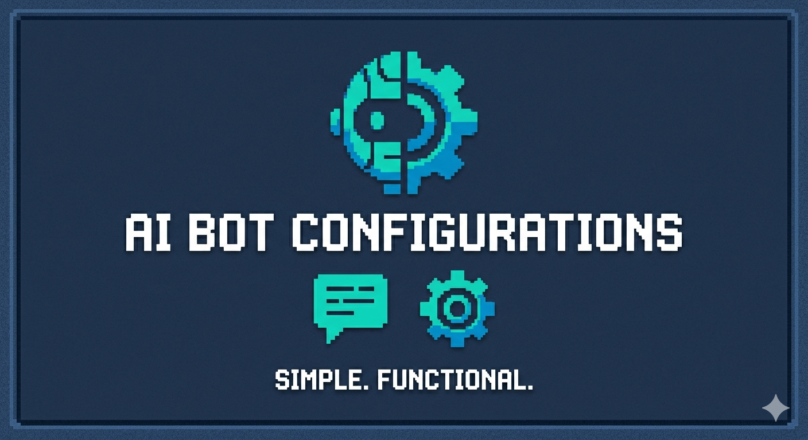

# AI Configs



> **📚 Documentação completa disponível em [docs/README.md](docs/README.md)**

Repositório de **configurações de agentes de IA** para padronização e melhoria do fluxo de desenvolvimento.

---

## 🎯 O que é este repositório?

Este é um repositório **meta** que centraliza configurações, regras e automações para agentes de IA como **OpenCode** e **Cursor**.

O objetivo é garantir que qualquer agente de IA trabalhando neste ecossistema siga:
- Padrões de código consistentes
- Fluxos de trabalho versionados (Git)
- Regras de segurança e arquitetura
- Processos de revisão automatizados

---

## 🚀 Como usar

### Configuração Global (OpenCode)

Clone este repositório em `~/.config/opencode/` para usar como config global:

```bash
git clone git@github.com:rodrigocnascimento/bot-configs.git ~/.config/opencode
```

Isso faz com que todas as regras, comandos e tools definidos aqui sejam carregados automaticamente em **todos os projetos** que você usar com OpenCode.

### Configuração por Projeto

Em cada projeto, você pode adicionar configs específicas que **se misturam** com as globais. O OpenCode mergeia as duas camadas:

```
meu-projeto/
├── .opencode/          # configs extras só deste projeto
│   ├── rules/          # regras adicionais
│   ├── commands/       # comandos adicionais
│   └── agents/         # agents adicionais
├── AGENTS.md           # contexto específico do projeto
└── opencode.json       # overrides (modelo, provider, etc)
```

**Como funciona o merge:**
- Configs globais (`~/.config/opencode/`) → base que vale pra tudo
- Configs do projeto (`.opencode/`) → adiciona ou sobrespecifica
- Se houver conflito, o projeto ganha. Se não, tudo se complementa.

### Exemplo prático

| Onde | O que colocar |
|---|---|
| `~/.config/opencode/rules/` | Regras que valem pra **todos** os projetos |
| `meu-projeto/.opencode/rules/` | Regras extras **só daquele projeto** |
| `~/.config/opencode/commands/` | Comandos globais (`/tdp`, `/release`, etc) |
| `meu-projeto/.opencode/commands/` | Comandos extras **só daquele projeto** |
| `meu-projeto/AGENTS.md` | Contexto da codebase (gerado por `/init`) |

---

## 🏗️ Estrutura do Repositório

```
├── rules/              # Regras operacionais do OpenCode
├── commands/           # Comandos personalizados do OpenCode
├── skills/             # Skills especializadas
├── tools/              # Ferramentas customizadas
├── .cursor/            # Configurações do Cursor
│   ├── rules/          # Regras de review
│   ├── skills/         # Skills especializadas
│   └── mcp.json        # Configurações MCP (Jira, GitLab)
│
├── specs/              # Technical Design Documents (TDDs)
├── docs/               # 📚 Documentação completa (confluence-ready)
│
└── AGENTS.md           # Guia para agentes de IA
```

---

## 🤖 OpenCode

**OpenCode** é um agente de IA que opera diretamente no repositório, seguindo regras definidas em `rules/`.

### Regras OpenCode

| Arquivo | Descrição |
|---------|-----------|
| `10-no-pull-main.md` | Proteger branches principais (`main`, `master`) |
| `20-new-branch-feature.md` | Protocolo de criação de branches a partir da base estável |
| `30-no-push-forcce.md` | Bloquear force-push e operações destrutivas |
| `40-no-root-aliasses-backend.md` | Proibir uso de aliases (`@/`, `~/*`) |
| `50-plan-before-work.md` | Technical Design Phase (TDP) obrigatório |
| `60-migration-entity.md` | Completude Entity + Migration |
| `70-vbca.md` | Version Bump & Changelog após aprovação |
| `80-release-governance.md` | Governança de release com aprovação explícita |
| `90-mermaid-only-diagrams.md` | Apenas diagramas Mermaid |

### Comandos OpenCode

| Comando | Descrição |
|---------|-----------|
| `/tdp` | Iniciar Technical Design Phase |
| `/finish-task` | Finalizar tarefa e solicitar aprovação |
| `/release` | Executar release update após aprovação |

### Fluxo de Trabalho OpenCode

```
1. Criar branch a partir da base estável
   → git checkout -b feat/LABS-123-minha-feature

2. Criar TDD em specs/tdd-labs-123-minha-feature.md
   → /tdp

3. Implementar código

4. Solicitar aprovação
   → /finish-task

5. Executar release (se aprovado)
   → /release
```

---

## 🐄 Cursor

**Cursor** é um IDE com capacidades de IA para code review automatizado e pair programming.

### Skills Cursor

#### backend-code-review
Skill especializada em revisar código backend Node.js/TypeScript.

**Funcionalidades:**
- Validação de requisitos do Jira
- Detecção de anti-patterns
- Análise de segurança
- Verificação de arquitetura Clean Architecture
- Revisão de performance e queries

**Configuração:**
[Instalação](docs/instalação.md)

**Uso:**
```
/backend-code-review revise o MR: https://gitlab.com/projeto/-/merge_requests/123
```

### Regras Cursor

| Arquivo | Descrição |
|---------|-----------|
| `backend-review-mode.md` | Modo de revisão técnica profunda |
| `backend-security-review.md` | Análise de segurança (OWASP-inspired) |
| `backend-anti-patterns.md` | Detecção de anti-patterns |
| `staff-engineer-review.md` | Revisão de nível Staff Engineer |

---

## 🔒 Regras de Segurança (Block Merge)

Os seguintes problemas **bloqueiam o merge**:

- **SQL Injection**: Queries construídas dinamicamente
- **Mass Assignment**: Salvando `req.body` diretamente
- **Autenticação ausente**: Endpoints sensíveis sem proteção
- **Secrets hardcoded**: Credenciais no código

### Como Detectar

```typescript
// ❌ SQL Injection
await repo.query(`SELECT * FROM users WHERE id = ${userId}`)

// ✅ Correto
await repo.query('SELECT * FROM users WHERE id = ?', [userId])
```

---

## 🏛️ Arquitetura Esperada

```
controller → usecase/service → repository → database
```

**Violações críticas:**
- Controller acessando repository diretamente
- Use case conhecendo Express/HTTP
- Domínio dependendo de ORM/infraestrutura

---

## 📋 Conventional Commits

Todos os commits devem seguir:

```
<tipo>(<escopo>): <descrição>
```

**Tipos permitidos:**
- `feat` — Nova funcionalidade
- `fix` — Correção de bug
- `docs` — Documentação
- `refactor` — Refatoração
- `test` — Testes
- `chore` — Tarefas de manutenção

**Exemplos:**
```
feat(api): adicionar endpoint de autenticação
fix(ui): corrigir formatação de data no dashboard
docs(tdd): adicionar design da feature
```

---

## 🔗 Integrações

### MCP (Model Context Protocol)

O repositório já inclui configurações para:

| Serviço | Descrição |
|---------|-----------|
| **Atlassian (Jira)** | Ler tickets e critérios de aceite |
| **GitLab** | Acessar MRs e postar comentários |

Configuração em `.cursor/mcp.json`.

---

## 📝 Licença

Este repositório é para uso interno da equipe.
