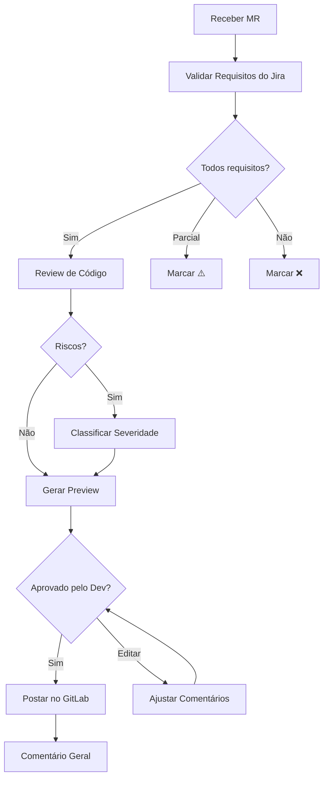

# Cursor - Visão Geral

## O que é?

**Cursor** é um IDE com capacidades de IA para desenvolvimento assistido. Diferente do OpenCode (que opera em CLI), o Cursor oferece interface visual com chat integrado.

## Diferenças entre OpenCode e Cursor

| Aspecto | OpenCode | Cursor |
|---------|----------|--------|
| Interface | CLI | Visual/Chat |
| Foco | Execução | Code Review |
| Acesso | Terminal | IDE |
| Integração | Git, Jira | GitLab, Jira (MCP) |
| Customização | Rules + Commands | Rules + Skills |

## Estrutura do Cursor

```
.cursor/
├── rules/          # Regras de review
├── skills/        # Skills especializadas
│   └── backend-code-review/
│       ├── SKILL.md
│       └── references/
│           ├── comment-templates.md
│           └── review-rules.md
└── mcp.json       # Configurações MCP
```

---

## MCP (Model Context Protocol)

O Cursor usa MCP para conectar com serviços externos.

### Configuração Atual

```json
// .cursor/mcp.json
{
  "mcpServers": {
    "Atlassian": {
      "command": "npx",
      "args": ["mcp-remote", "https://mcp.atlassian.com/v1/mcp"]
    },
    "GitLab": {
      "command": "npx",
      "args": ["mcp-remote", "https://gitlab.com.br/api/v4/mcp"]
    }
  }
}
```

### Serviços Conectados

| Serviço | Capacidade |
|---------|------------|
| **Atlassian (Jira)** | Ler tickets e critérios de aceite |
| **GitLab** | Acessar MRs e postar comentários |

---

## Skills Disponíveis

### backend-code-review

Skill principal para revisão automatizada de código backend.

**Funcionalidades:**
- Validação de requisitos vs. implementação
- Detecção de anti-patterns
- Análise de segurança
- Verificação de arquitetura
- Performance e queries

**Pré-requisitos:**
```bash
# Instalar CLI do GitLab
brew install glab

# Autenticar
glab auth login
# Escolher: gitlab.com.br
# Autenticar via navegador ou PAT
```

**Uso:**
```
/backend-code-review revise o MR: https://gitlab.com/projeto/-/merge_requests/123
```

---

## Regras de Review

| Arquivo | Escopo |
|---------|--------|
| `backend-review-mode.md` | Modo de revisão técnica |
| `backend-security-review.md` | Análise de vulnerabilidades |
| `backend-anti-patterns.md` | Detecção de code smells |
| `staff-engineer-review.md` | Revisão de nível senior |

---

## Fluxo de Review



---

## Próximos Passos

- [Skills](skills.md)
- [Regras de Review](regras-de-review.md)
