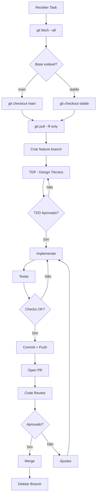
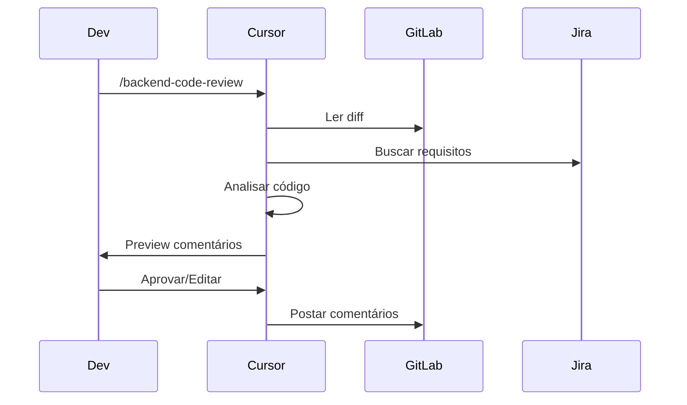
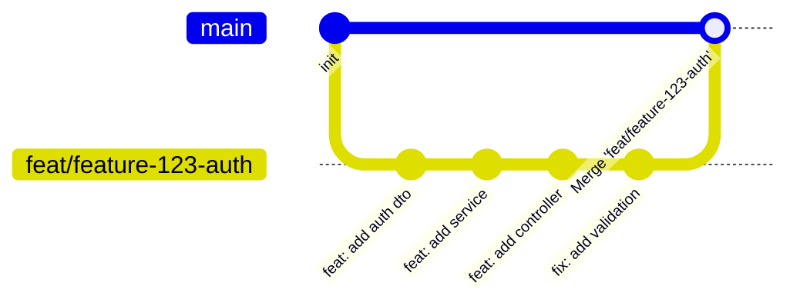

# Feature Branch Flow

## Visão Geral

Fluxo completo para implementação de uma nova feature, desde a criação da branch até o merge.

---

## Passo a Passo



---

## 1. Preparar Ambiente

```bash
# Atualizar todas as branches
git fetch --all --prune

# Verificar branches locais e remotas
git branch -a
```

---

## 2. Identificar Base Estável

Prioridade:
1. `stable` (se existir)
2. `main`
3. `master`

```bash
# Checkout na base estável
git checkout main

# Garantir que está atualizado
git pull --ff-only

# Se falhar, há conflitos a resolver
```

---

## 3. Criar Feature Branch

### Formato
```
<tipo>/<issue-id>-<slug>
```

### Exemplos

```bash
# Nova feature
git checkout -b feat/feature-123-user-authentication

# Bug fix
git checkout -b fix/ISSUE-456-login-error

# Chore
git checkout -b chore/feature-789-deps-update
```

### Checklist
- [ ] Branch criada da base correta
- [ ] Nome segue formato
- [ ] Issue ID incluída

---

## 4. Technical Design Phase

Executar `/tdp` e criar TDD em `specs/tdd-<slug>.md`.

### Estrutura do TDD

```markdown
# TDD: [Feature Name]

## Objective & Scope
- What: ...
- Why: ...

## Proposed Technical Strategy
- Logic Flow
- Impacted Files
- Language-Specific Guardrails

## Implementation Plan
- Pseudocode
- Path Resolution
- Naming Standards
```

### Aguardar Aprovação

```
Mestre, TDD criado em specs/tdd-feature-123-auth.md

Aprova a abordagem?

[Sim] ou [Não, ajustar: ...]
```

---

## 5. Implementar

### Checklist de Implementação
- [ ] Código compila
- [ ] Testes passando
- [ ] Lint passando
- [ ] DTOs criados
- [ ] Validações implementadas
- [ ] Erros tratados
- [ ] Arquitetura respeitada

### Referências
- [Code Style](../regras/code-style.md)
- [Arquitetura](../regras/arquitetura.md)
- [Segurança](../regras/segurança.md)

---

## 6. Commits

### Conventional Commits

```bash
# Adicionar arquivos
git add .

# Commit
git commit -m "feat(api): add JWT authentication endpoint"

# Push
git push -u origin feat/feature-123-user-authentication
```

### Regras
- Um commit = uma mudança lógica
- Imperativo, sem ponto final
- Descrição clara

---

## 7. Pull Request

### Criar PR

```bash
# Via CLI (GitLab)
glab mr create \
  --title "feat(api): add JWT authentication" \
  --description "## Summary\n\n- Add JWT auth endpoint\n- Implement token validation\n\nCloses feature-123" \
  --target-branch main \
  --source-branch feat/feature-123-user-authentication
```

### Descrição do PR

```markdown
## Summary
- [ ] O que foi implementado
- [ ] Mudanças principais

## Testing
- [ ] Testes unitários
- [ ] Testes de integração

## Screenshots (se aplicável)

## Related Issues
Closes feature-123
```

### Checklist do PR
- [ ] Título em Conventional Commits
- [ ] Descrição completa
- [ ] Link para issue
- [ ] Testes incluídos
- [ ] CI/CD passando

---

## 8. Code Review

Revisores verificam:
- [Funcionalidade](../cursor/regras-de-review.md)
- [Segurança](../regras/segurança.md)
- [Arquitetura](../regras/arquitetura.md)
- [Code Style](../regras/code-style.md)

### Fluxo de Review



---

## 9. Merge

### Pré-requisitos
- [ ] PR approved
- [ ] CI/CD passando
- [ ] Conflitos resolvidos
- [ ] Branch atualizada com base

### Merge via GitLab UI
1. Clicar "Merge"
2. Escolher "Squash commits" (opcional)
3. Confirmar

### Merge via CLI
```bash
glab mr merge feature-123
```

---

## 10. Limpeza

```bash
# Deletar branch local
git branch -d feat/feature-123-user-authentication

# Deletar branch remota
git push origin --delete feat/feature-123-user-authentication

# Atualizar local
git fetch --prune
```

---

## Resumo Visual


