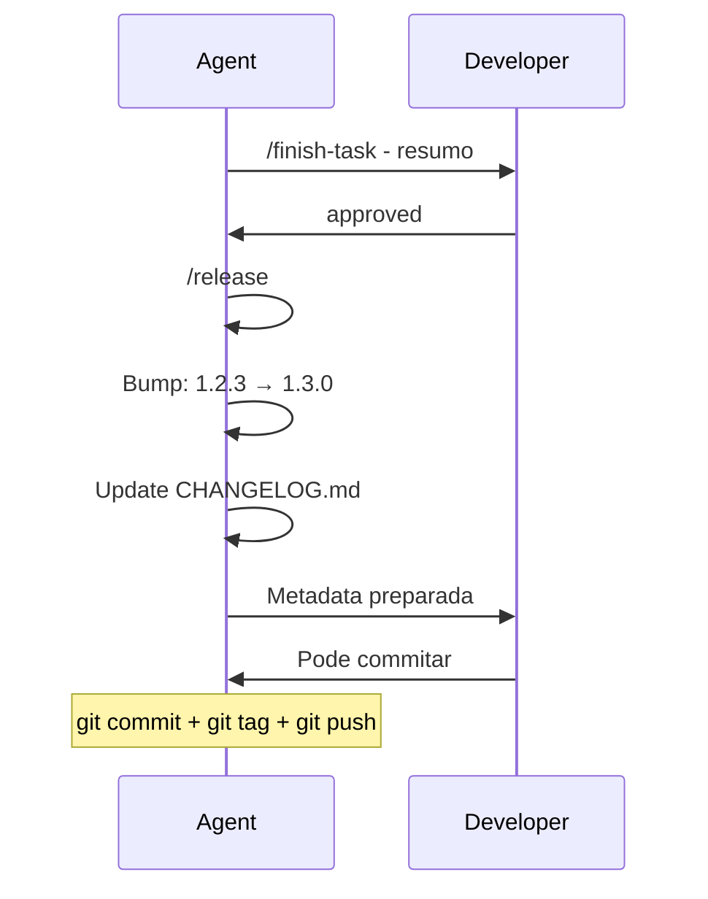

# Release Process

## Visão Geral

Fluxo para finalizar uma task e preparar release, incluindo version bump e changelog.

---

## Fluxo Completo

```mermaid
flowchart TD
    A[Task Concluída] --> B[/finish-task]
    B --> C[Resumo da Entrega]
    C --> D{Developer Aprova?}
    D -->|Não| E[Ajustar]
    E --> A
    D -->|Sim| F[/release]
    F --> G[Bump Version]
    G --> H[Update CHANGELOG]
    H --> I[Preparar Metadata]
    I --> J[Pronto para Commit]
```

---

## 1. /finish-task - Finalizar Tarefa

### Quando Usar
Ao concluir qualquer task (feat, fix, refactor, chore).

### Output Esperado

```markdown
## Task Completed

### Summary
- Feature X implementada
- DTO Y criado
- Testes Z adicionados

### Files Changed
- src/features/x.ts (novo)
- src/dto/y.dto.ts (modificado)
- tests/features/x.spec.ts (novo)

### Change Classification
feat

### Current Version
1.2.3

### Recommended Bump
MINOR

### Next Version
1.2.4

---

❓ Aprova estas mudanças e o version bump proposto, Developer?
```

### Regras do /finish-task

| Pode | Não Pode |
|------|----------|
| ✅ Resumir entrega | ❌ Atualizar versão |
| ✅ Classificar mudança | ❌ Modificar CHANGELOG |
| ✅ Sugerir bump | ❌ Criar commit |
| ✅ Pedir aprovação | ❌ Criar tag |

---

## 2. Aprovação do Developer

### Aprovações Válidas
- "sim"
- "yes"
- "approved"
- "ok"
- "proceed"

### Rejeições
```
Understood. What adjustments should be made before approval?
```

---

## 3. /release - Executar Release

### Pré-condições (Hard Stops)

| # | Condição | Status |
|---|----------|--------|
| 1 | `/finish-task` executado | 🔴 Se não, bloqueia |
| 2 | Aprovação obtida | 🔴 Se não, bloqueia |
| 3 | Tipo de bump definido | 🔴 Se não, bloqueia |

### Se Pré-condições Não Satisfeitas

```
⚠️ Explicit approval is required before running the release update.
⚠️ Run /finish-task before /release.
```

---

## 4. Identificar Fonte de Versão

O agente identifica onde a versão está configurada:

| Prioridade | Arquivo |
|------------|---------|
| 1 | package.json |
| 2 | composer.json |
| 3 | pyproject.toml |
| 4 | Cargo.toml |
| 5 | Outro arquivo definido |

---

## 5. Semantic Versioning

### Tipos de Bump

| Classificação | Bump | Exemplo |
|---------------|------|---------|
| Bug fix | PATCH | 1.2.3 → 1.2.4 |
| Feature | MINOR | 1.2.3 → 1.3.0 |
| Breaking | MAJOR | 1.2.3 → 2.0.0 |

### Exemplos

```json
// Antes: package.json
{ "version": "1.2.3" }

// Depois (patch): 
{ "version": "1.2.4" }

// Depois (minor):
{ "version": "1.3.0" }

// Depois (major):
{ "version": "2.0.0" }
```

---

## 6. Update CHANGELOG.md

### Formato

```markdown
## [1.2.4] - 2026-03-26

### Added
- Nova funcionalidade X

### Changed
- Melhoria em Y

### Fixed
- Correção do bug Z

### Removed
- Funcionalidade depreciada W
```

### Regras

1. **Entrada mais recente no topo**
2. **Usar data atual**: `YYYY-MM-DD`
3. **Categorias**: Only existing categories
4. **Descrição**: Objetiva e curta

### Exemplo Completo

```markdown
# CHANGELOG

## [1.2.4] - 2026-03-26

### Added
- Adicionado endpoint de autenticação JWT em POST /api/auth/login
- Novo módulo de validação de email

### Fixed
- Corrigido timeout em operações de banco
- Corrigido memory leak em conexões

## [1.2.3] - 2026-03-20

### Added
- Initial release
```

---

## 7. Validação de Consistência

Após update, o agente verifica:

| Check | Descrição |
|-------|-----------|
| Versão atualizada | package.json/changelog bate |
| Changelog completo | Entrada corresponde à entrega |
| Bump correto | Tipo = classificação aprovada |

---

## 8. Preparar Metadata

### Output Final

```markdown
## Release Prepared

| Item | Valor |
|------|-------|
| Versão Anterior | 1.2.3 |
| Nova Versão | 1.2.4 |
| Tipo | MINOR |
| Arquivos | package.json, CHANGELOG.md |

### Commits Realizados
- 1.2.3 → 1.2.4 (minibump)

### Sugestões

**Commit Message:**
```
chore(release): bump version to 1.2.4
```

**Tag:**
```
v1.2.4
```

---

## 9. Regras Finais

### O que NÃO Faz Automaticamente

| Ação | Pode? |
|------|-------|
| git commit | ❌ Não |
| git tag | ❌ Não |
| git push | ❌ Não |
| npm publish | ❌ Não |

### Motivo
Tudo automático pode causar problemas. O developer decide quando fazer commit/push.

---

## Exemplo Completo

### 1. /finish-task

```
Agent: Tarefa concluída. Executando /finish-task...

## Task Completed

### Summary
- Adicionado endpoint POST /api/auth/login
- Implementado JWT com refresh token
- Adicionado logout endpoint

### Files Changed
- src/auth/auth.controller.ts
- src/auth/auth.service.ts
- src/auth/dto/login.dto.ts
- src/auth/jwt.strategy.ts
- tests/auth/auth.service.spec.ts

### Change Classification
feat

### Current Version
1.2.3

### Recommended Bump
MINOR

### Next Version
1.3.0

---

❓ Aprova estas mudanças e o version bump proposto, Developer?
```

### 2. Developer Responde

```
User: sim, approved
```

### 3. /release

```
Agent: Executando /release...

✅ Versão atualizada: 1.2.3 → 1.3.0
✅ CHANGELOG.md atualizado

## Release Prepared

| Item | Valor |
|------|-------|
| Versão Anterior | 1.2.3 |
| Nova Versão | 1.3.0 |
| Tipo | MINOR |
| Arquivos | package.json, CHANGELOG.md |

### Sugestões

**Commit:**
chore(release): bump version to 1.3.0

**Tag:**
v1.3.0

Deseja que eu execute o commit?
```

### 4. Developer Confirma

```
User: sim, pode commitar
```

---

## Fluxo Visual


