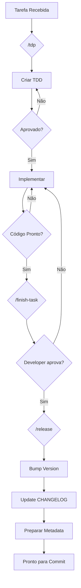

# OpenCode - Comandos

## Visão Geral

Comandos customizados permitem automatizar fluxos complexos do OpenCode.

---

## /tdp - Technical Design Phase

### Descrição
Inicia o processo de design técnico antes da implementação.

### Quando usar
Quando o usuário solicita uma nova feature, refatoração ou correção significativa.

### Pré-requisitos
1. Identificar branch estável (`stable` > `main` > `master`)
2. Estar na branch correta

### Passo a Passo

```
1. Identificar base estável
   → git fetch --all --prune
   → git branch

2. Criar TDD em specs/tdd-<feature-slug>.md

3. Estrutura do TDD:
   - Objective & Scope
   - Proposed Technical Strategy
   - Implementation Plan

4. Perguntar: "Aprova esta abordagem técnica, Developer?"

5. Aguardar: "yes", "approved", "ok", "sim"
```

### Hard Stop
```
🔴 IMPAR: Aprovação não obtida.
Não prossiga para implementação até aprovação explícita.
```

---

## /finish-task - Finalizar Tarefa

### Descrição
Resume a entrega concluída e solicita aprovação para version bump.

### Quando usar
Ao finalizar qualquer task (feat, fix, refactor).

### Output Obrigatório

```markdown
## Task Completed

### Summary
- [ ] O que foi implementado/corrigido

### Files Changed
- arquivo1.ts
- arquivo2.ts

### Change Classification
- fix | feat | breaking change

### Current Version
- 1.2.3

### Recommended Bump
- PATCH | MINOR | MAJOR

### Next Version
- 1.2.4

---

❓ Aprova estas mudanças e o version bump proposto, Developer?
```

### O que NÃO faz
- ❌ Não atualiza versão
- ❌ Não modifica CHANGELOG.md
- ❌ Não cria commit
- ❌ Não cria tag

### Fluxo
```
finish-task → Approval → /release
```

---

## /release - Release Update

### Descrição
Executa update de versão após aprovação explícita.

### Pré-condições (Hard Stop)
1. `/finish-task` executado no contexto atual
2. Aprovação explícita obtida
3. Tipo de bump definido

### Se pré-condições não atendidas
```
⚠️ Aprovação explícita é necessária antes do release.
⚠️ Execute /finish-task antes de /release.
```

### Ações Executadas

| # | Ação | Descrição |
|---|------|-----------|
| 1 | Identificar fonte de versão | package.json, composer.json, etc |
| 2 | Aplicar bump | PATCH/MINOR/MAJOR |
| 3 | Atualizar CHANGELOG.md | Nova entrada no topo |
| 4 | Validar consistência | Versão = Changelog |
| 5 | Preparar metadata | Commit message e tag |

### CHANGELOG Format
```markdown
## [1.2.4] - 2026-03-26

### Added
- Nova funcionalidade X

### Fixed
- Correção do bug Y
```

### O que NÃO faz
- ❌ Não executa `git commit`
- ❌ Não cria tag
- ❌ Não executa `git push`
- ❌ Não publica package

### Output Final
```markdown
## Release Prepared

| Item | Valor |
|------|-------|
| Versão Anterior | 1.2.3 |
| Nova Versão | 1.2.4 |
| Tipo | PATCH |
| Arquivos | package.json, CHANGELOG.md |

### Sugestões
- Commit: chore(release): bump version to 1.2.4
- Tag: v1.2.4

Deseja que eu execute o commit?
```

---

## Fluxo Completo



---

## Exemplos de Uso

### Novo Feature
```
User: preciso adicionar autenticação JWT
Agent: /tdp Adicionar autenticação JWT com refresh tokens
```

### Bug Fix
```
User: corrigir problema de login em produção
Agent: /tdp Corrigir bug de timeout no login
```

### Finalizar
```
Agent: Task concluída. /finish-task
User: approved
Agent: /release
```
