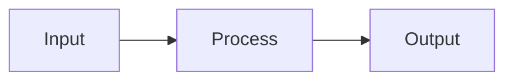

# OpenCode - Regras Operacionais

## Visão Geral

As regras do OpenCode são numeradas por prioridade (10-90), onde números menores indicam regras mais fundamentais.

---

## 10 - Protected Branch Guard (PBG)

### O que faz
Proíbe modificações diretas em branches protegidos (`main`, `master`).

### Regras
- `main` e `master` são **protegidos permanentemente**
- Não permite commit, merge, rebase, push ou force-push direto
- Força uso de Pull Request / Merge Request

### Quando ativado
Quando o agente detecta que está em uma branch protegida.

### Comportamento
```
⚠️ Você está na branch protegida 'main'. Modificações diretas estão bloqueadas.
Deseja criar uma feature branch?
→ git checkout -b feat/LABS-123-sua-feature
```

---

## 20 - Stable-Base Branching (SBB)

### O que faz
Garante que todo novo trabalho comece a partir da branch mais estável.

### Prioridade de Base Estável
1. `stable` (se existir)
2. `main`
3. `master`

### Protocolo
1. Identificar base estável
2. `git fetch --all --prune`
3. `git checkout <base-estável>`
4. `git pull --ff-only`
5. Criar branch: `feat/<issue-id>-<slug>`

### Exemplos
```
feat/LABS-123-user-authentication
fix/ISSUE-456-login-validation
```

---

## 30 - Git Governance System (GGS)

### Force Operations
Bloqueados por padrão:
- `git push --force`
- `git push -f`
- `git push --force-with-lease`
- `git reset --hard`

### Conventional Commits
Formato obrigatório: `<tipo>(<escopo>): <descrição>`

**Tipos:**
- `feat` — Nova funcionalidade
- `fix` — Correção
- `docs` — Documentação
- `refactor` — Refatoração
- `test` — Testes
- `chore` — Manutenção

**Exemplos:**
```
feat(api): adicionar endpoint de autenticação
fix(ui): corrigir formatação de data
```

---

## 40 - Strict Relative Imports

### O que proíbe
Uso de aliases de root como `@/`, `~/*`, `#/*`.

### Por quê
- Falhas em builds (ts-node, esbuild)
- Problemas em testes (Jest/Vitest)
- Inconsistência entre ferramentas

### Padrão Obrigatório
```typescript
// ❌ ERRADO
import { AuthService } from '@/services/auth.service';

// ✅ CORRETO
import { AuthService } from '../../services/auth.service';
```

---

## 50 - Technical Design Phase (TDP)

### O que exige
Documento de design técnico **antes** de qualquer código.

### Arquivo
`specs/tdd-<feature-slug>.md`

### Estrutura do TDD
```markdown
# TDD: [Feature Name]

## Objective & Scope
- What: ...
- Why: ...

## Proposed Technical Strategy
- Logic Flow
- Impacted Files
- Language-Specific Guardrails

## Implementation Plan
- Pseudocode
- Path Resolution
- Naming Standards
```

### Fluxo
1. Criar TDD
2. Perguntar: "Aprova esta abordagem técnica?"
3. Aguardar confirmação explícita
4. Implementar

---

## 60 - Entity + Migration Completeness

### O que exige
Para toda nova tabela no banco:
1. Criar Entity TypeORM
2. Criar Migration completa
3. Executar migration imediatamente
4. Incluir comentários na migration

### Comportamento
```
🔴 PARE: Migration não executada.
Execute: npm run migration:run
```

---

## 70 - Version Bump After Approval (VBCA)

### O que faz
Apenas atualiza versão e changelog **após aprovação explícita**.

### Fluxo
1. Task concluída
2. Resumir entrega
3. Perguntar: "Aprova?"
4. Se sim → bump + changelog
5. Se não → pedir ajustes

### Semantic Versioning
| Tipo | Bump |
|------|------|
| Bug fix | PATCH |
| Feature | MINOR |
| Breaking | MAJOR |

---

## 80 - Release Governance

### Regras
- `/finish-task` deve executar antes de `/release`
- Aprovação explícita é **obrigatória**
- Nunca faz push automático
- Nunca cria tag automática

---

## 90 - Mermaid-Only Diagrams

### O que proíbe
Diagramas ASCII, box drawings, ou arte em monospace.

### O que permite
Apenas blocos Mermaid:


---

## Ordem de Execução (Resumo)

| # | Regra | Hard Stop? |
|---|-------|-----------|
| 10 | Protected Branch | ✅ Sim |
| 20 | Stable Base | ✅ Sim |
| 30 | Git Governance | ✅ Sim |
| 40 | No Aliases | ✅ Sim |
| 50 | TDP | ✅ Sim |
| 60 | Migration | ✅ Sim |
| 70 | VBCA | ✅ Sim |
| 80 | Release | ✅ Sim |
| 90 | Mermaid | ⚠️ Aviso |

Em caso de conflito entre regras, a **mais restritiva** wins.
