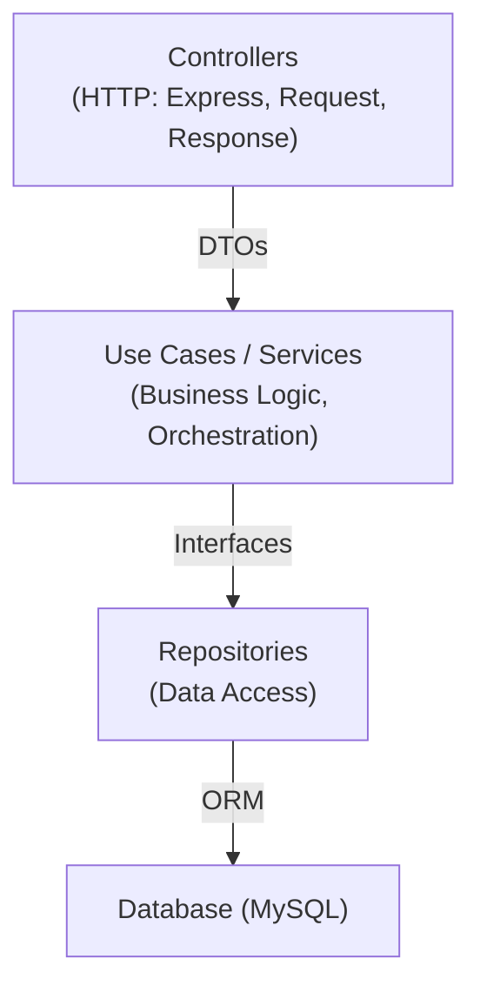
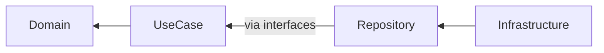
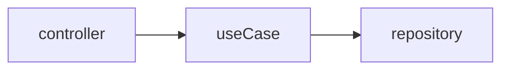

# Arquitetura - Clean Architecture

## Visão Geral

Padrões arquiteturais baseados em Clean Architecture para manter separação de responsabilidades e testabilidade.

---

## Arquitetura Esperada



---

## Camadas

### 1. Controller

**Responsabilidade:** HTTP (parse request, validate, format response)

**O que FAZ:**
- Extrair dados do request
- Validar formato básico
- Chamar use case
- Formatar resposta HTTP
- Tratar erros HTTP

**O que NÃO FAZ:**
- ❌ Lógica de negócio
- ❌ Acesso direto ao banco
- ❌ Conhecer ORM
- ❌ Conhecer Express internamente

```typescript
// ✅ CORRETO
class CreateUserController {
  constructor(private createUserUseCase: ICreateUserUseCase) {}

  async execute(req: Request, res: Response): Promise<Response> {
    try {
      const dto: CreateUserDTO = {
        name: req.body.name,
        email: req.body.email,
        password: req.body.password,
      };

      const user = await this.createUserUseCase.execute(dto);
      return res.status(201).json(user);
    } catch (error) {
      if (error instanceof AppError) {
        return res.status(error.statusCode).json({ error: error.message });
      }
      return res.status(500).json({ error: 'Internal server error' });
    }
  }
}

// ❌ ERRADO
class CreateUserController {
  async execute(req: Request, res: Response) {
    const user = await userRepository.save(req.body);  // ❌ Controller acessando DB
    const hashedPassword = bcrypt.hash(req.body.password);  // ❌ Lógica aqui
    // ...
  }
}
```

---

### 2. Use Case / Service

**Responsabilidade:** Lógica de negócio

**O que FAZ:**
- Regras de negócio
- Validações de domínio
- Coordenação de repositories
- Tratamento de erros de domínio

**O que NÃO FAZ:**
- ❌ Conhecer HTTP/Express
- ❌ Acessar `req` ou `res`
- ❌ Conhecer ORM
- ❌ Formatar respostas HTTP

```typescript
// ✅ CORRETO
interface ICreateUserUseCase {
  execute(dto: CreateUserDTO): Promise<User>;
}

class CreateUserUseCase implements ICreateUserUseCase {
  constructor(
    private userRepository: IUserRepository,
    private emailValidator: IEmailValidator,
  ) {}

  async execute(dto: CreateUserDTO): Promise<User> {
    // Validação de domínio
    if (!this.emailValidator.isValid(dto.email)) {
      throw new AppError('Invalid email', 400, 'INVALID_EMAIL');
    }

    // Verificar duplicidade
    const existing = await this.userRepository.findByEmail(dto.email);
    if (existing) {
      throw new AppError('Email already exists', 409, 'EMAIL_EXISTS');
    }

    // Criar usuário
    const user = new User(dto.name, dto.email, dto.password);
    return this.userRepository.save(user);
  }
}

// ❌ ERRADO
class CreateUserUseCase {
  async execute(req: Request, res: Response) {  // ❌ Conhece HTTP
    const email = req.body.email;  // ❌ Acessa req diretamente
    // ...
    res.json(user);  // ❌ Envia resposta
  }
}
```

---

### 3. Repository

**Responsabilidade:** Acesso a dados

**O que FAZ:**
- Operações CRUD
- Queries complexas
- Conhecer ORM/banco

**O que NÃO FAZ:**
- ❌ Lógica de negócio
- ❌ Validações de domínio
- ❌ Conhecer controllers

```typescript
// ✅ Interface (domain)
interface IUserRepository {
  findByEmail(email: string): Promise<User | null>;
  save(user: User): Promise<User>;
  findById(id: string): Promise<User | null>;
}

// ✅ Implementação (infra)
class UserRepository implements IUserRepository {
  constructor(private repository: Repository<User>) {}

  async findByEmail(email: string): Promise<User | null> {
    return this.repository.findOne({ where: { email } });
  }

  async save(user: User): Promise<User> {
    return this.repository.save(user);
  }
}
```

---

### 4. Domain / Entities

**Responsabilidade:** Modelo de dados e regras de domínio

**O que FAZ:**
- Entidades do negócio
- Validações intrínsecas
- Métodos de domínio

**O que NÃO FAZ:**
- ❌ Conhecer ORM
- ❌ Conhecer HTTP
- ❌ Conhecer frameworks

```typescript
// ✅ Entity pura
class User {
  private constructor(
    public readonly id: string,
    public name: string,
    public email: string,
    private password: string,
    public status: UserStatus,
    public readonly createdAt: Date,
  ) {}

  static create(data: CreateUserDTO): User {
    if (!data.email.includes('@')) {
      throw new Error('Invalid email');
    }
    return new User(
      crypto.randomUUID(),
      data.name,
      data.email,
      data.password,
      UserStatus.ACTIVE,
      new Date(),
    );
  }

  deactivate(): void {
    this.status = UserStatus.INACTIVE;
  }
}

// ❌ ERRADO - Entity conhece ORM
@Entity()
class User {  // ❌ Decorator TypeORM aqui viola domínio
  @PrimaryGeneratedColumn()
  id: string;
  
  @Column()
  email: string;
  // ...
}
```

---

## Dependency Rule



**Regras:**
1. Dependências apontam para dentro
2. Domínio não conhece nada externo
3. UseCases conhecem interfaces (não implementações)
4. Implementações injetadas via DI

---

## Dependency Injection (tsyringe)

```typescript
// interfaces/user.repository.interface.ts
interface IUserRepository {
  findByEmail(email: string): Promise<User | null>;
  save(user: User): Promise<User>;
}

// repositories/user.repository.ts
@injectable()
class UserRepository implements IUserRepository {
  constructor(
    @inject('UserEntity') private userEntity: typeof User,
    @inject('DataSource') private dataSource: DataSource,
  ) {}

  async findByEmail(email: string): Promise<User | null> {
    return this.dataSource.getRepository(this.userEntity)
      .findOne({ where: { email } });
  }
}

// use-cases/create-user.use-case.ts
@injectable()
class CreateUserUseCase {
  constructor(
    @inject('IUserRepository') private userRepository: IUserRepository,
  ) {}

  async execute(dto: CreateUserDTO): Promise<User> {
    // ...
  }
}
```

---

## Anti-Patterns Arquiteturais

### 🔴 Controller acessa Repository

```typescript
// ❌ VIOLAÇÃO
app.post('/users', async (req, res) => {
  await userRepository.save(req.body);  // Controller conhece DB!
});
```

**Correto:**


---

### 🔴 UseCase conhece Express

```typescript
// ❌ VIOLAÇÃO
class CreateUserUseCase {
  async execute(req: Request, res: Response) {  // Conhece HTTP!
    const email = req.body.email;
  }
}
```

**Correto:**
```
UseCase só conhece DTOs e interfaces
```

---

### 🔴 Domínio conhece ORM

```typescript
// ❌ VIOLAÇÃO
@Entity()
class User {
  @PrimaryGeneratedColumn()
  id: string;
}
```

**Correto:**
```
Domain: classes puras
Infrastructure: decorators e mapeamentos
```

---

### 🟡 Service com muitas responsabilidades

```typescript
// ❌ MUITO GRANDE
class UserService {
  async create() { ... }
  async update() { ... }
  async delete() { ... }
  async sendEmail() { ... }  // Não é responsabilidade de UserService
  async generateReport() { ... }  // Não é responsabilidade de UserService
}
```

**Correto:**
```
UserService: só operações de User
EmailService: envio de emails
ReportService: relatórios
```

---

### 🟡 Função grande

Heurísticas:
- > 50 linhas = provavelmente precisa dividir
- Múltiplas responsabilidades
- Níveis de abstração misturados

```typescript
// ❌ PRECISA DIVIDIR
async function processOrder(order: Order) {
  // 100 linhas de código
}

// ✅ DIVIDIDO
async function processOrder(order: Order) {
  await validateOrder(order);
  await calculateTotals(order);
  await applyDiscounts(order);
  await saveOrder(order);
  await notifyCustomer(order);
}
```

---

## Testabilidade

### Como testar UseCase

```typescript
describe('CreateUserUseCase', () => {
  it('should create user with valid data', async () => {
    // Mock do repository
    const mockRepo = {
      findByEmail: jest.fn().mockResolvedValue(null),
      save: jest.fn().mockResolvedValue(user),
    };

    // Mock do validator
    const mockValidator = {
      isValid: jest.fn().mockReturnValue(true),
    };

    const useCase = new CreateUserUseCase(mockRepo, mockValidator);
    const result = await useCase.execute(createUserDTO);

    expect(result).toEqual(user);
    expect(mockRepo.save).toHaveBeenCalled();
  });

  it('should throw error if email exists', async () => {
    const mockRepo = {
      findByEmail: jest.fn().mockResolvedValue(existingUser),
    };
    
    const useCase = new CreateUserUseCase(mockRepo, mockValidator);
    
    await expect(useCase.execute(createUserDTO))
      .rejects.toThrow(AppError);
  });
});
```

---

## Checklist Arquitetural

- [ ] Controller só orquestra HTTP
- [ ] UseCases contêm lógica de negócio
- [ ] Repositories implementam interfaces
- [ ] Domínio não conhece ORM/Express
- [ ] Dependências injetadas (DI)
- [ ] Funções pequenas e focadas
- [ ] Camadas respeitam Dependency Rule
