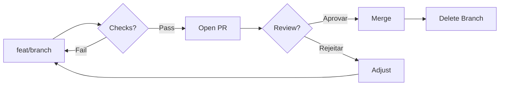
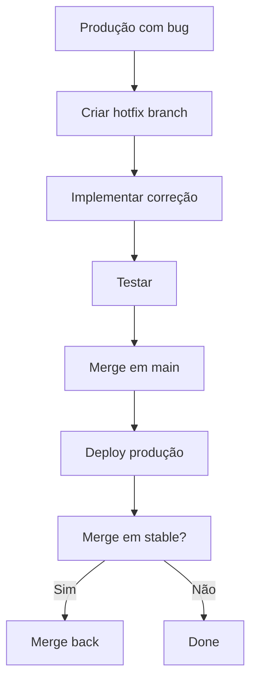

# Git Governance

## Visão Geral

Regras de governança Git para garantir estabilidade, rastreabilidade e segurança no processo de desenvolvimento.

---

## Branches Protegidas

### Lista de Branches Protegidas

| Branch | Status |
|--------|--------|
| `main` | 🔒 Protegida |
| `master` | 🔒 Protegida |
| `stable` | 🔒 Protegida (se existir) |

### O que significa "protegida"?

- ❌ Não permite push direto
- ❌ Não permite force push
- ❌ Não permite merge local
- ❌ Não permite rebase
- ✅ Exige Pull Request / Merge Request
- ✅ Exige code review
- ✅ Exige CI/CD passando

### Operações Bloqueadas

```bash
# ❌ BLOQUEADO
git push origin main

# ❌ BLOQUEADO
git push --force origin main

# ❌ BLOQUEADO
git push -f

# ❌ BLOQUEADO
git reset --hard HEAD~1  # em branch compartilhada
```

---

## Branch Naming

### Formato Obrigatório

```
<tipo>/<issue-id>-<slug>
```

### Tipos de Branch

| Tipo | Uso | Exemplo |
|------|-----|---------|
| `feat/` | Nova funcionalidade | `feat/LABS-123-user-auth` |
| `fix/` | Correção de bug | `fix/ISSUE-456-login-error` |
| `hotfix/` | Correção urgente | `hotfix/PROD-789-crash` |
| `chore/` | Manutenção | `chore/LABS-111-deps-update` |
| `refactor/` | Refatoração | `refactor/LABS-222-cleanup` |

### Issue ID

| Plataforma | Formato | Exemplo |
|------------|---------|---------|
| GitHub | `GH-<numero>` | `GH-123` |
| Jira | `<PROJETO>-<numero>` | `LABS-123`, `PROD-789` |
| Genérico | `ISSUE-<numero>` | `ISSUE-7` |

### Slug

- Minúsculas
- Kebab-case (hífen para separar palavras)
- Sem espaços
- Curto e descritivo

### Exemplos

```
✅ feat/LABS-123-user-authentication
✅ feat/GH-214-todo-due-indicators
✅ fix/ISSUE-9-login-validation
✅ hotfix/PROD-789-database-connection

❌ feat/123
❌ feat/user-auth
❌ fix/labs123
❌ feat/LABS123USERAUTH
```

---

## Commit Messages

### Formato (Conventional Commits)

```
<tipo>(<escopo>): <descrição>
```

### Tipos Permitidos

| Tipo | Descrição |
|------|-----------|
| `feat` | Nova funcionalidade |
| `fix` | Correção de bug |
| `docs` | Apenas documentação |
| `style` | Formatação (não lógica) |
| `refactor` | Refatoração (sem mudar comportamento) |
| `perf` | Melhoria de performance |
| `test` | Adicionar ou corrigir testes |
| `build` | Mudanças em build ou dependências |
| `ci` | Mudanças em CI/CD |
| `chore` | Tarefas de manutenção |

### Regras

1. **Imperativo**: "add", não "added" ou "adds"
2. **Sem ponto final**
3. **Curto**: primeira linha até 72 caracteres
4. **Corpo opcional**: explicar o "porquê" se necessário

### Exemplos

```
✅ feat(api): add user authentication endpoint
✅ fix(ui): correct date formatting in dashboard
✅ docs(readme): update installation instructions
✅ refactor(auth): extract token validation to service
✅ test(user): add unit tests for createUser

❌ Fixed bug
❌ WIP
❌ Changes made
❌ feat: add new feature for user login functionality
```

### Commits Atômicos

Um commit deve conter **uma única mudança lógica**.

```
✅ commit: add email validation
✅ commit: fix timezone bug in scheduler
✅ commit: update dependencies

❌ commit: add auth, fix ui, update deps (3 em 1)
```

---

## Fluxo de Merge

### Fluxo Obrigatório



### Pull Request Checklist

- [ ] Branch nomeada corretamente
- [ ] Commits em Conventional Commits
- [ ] CI/CD passando
- [ ] Code review aprovado
- [ ] Descrição clara do PR
- [ ] Link para issue/ticket

---

## Force Operations

### Proibido por Padrão

| Operação | Status |
|----------|--------|
| `--force` | 🔴 Bloqueado |
| `-f` | 🔴 Bloqueado |
| `--force-with-lease` | 🔴 Bloqueado |

### Quando é Permitido

Apenas com **autorização explícita** do developer:
```
"Deseja fazer force push para <branch>?"
→ "sim, authorize"
→ Pode executar
```

### Alternatives ao Force Push

```bash
# ❌ EVITAR
git push --force

# ✅ PREFERIR
git push --force-with-lease  # Um pouco mais seguro

# ✅ MELHOR (se possível)
git checkout feature/branch
git merge main  # Merge ao invés de rebase
```

---

## Rebase

### Rebase Local (OK)

```bash
# Rebase da própria branch feature (OK)
git checkout feat/my-feature
git rebase main
```

### Rebase de Branch Compartilhada (Não)

```bash
# ❌ EVITAR
git rebase main  # em branch que outros usam
```

### Por quê?

Rebase **reescreve histórico**. Se a branch foi compartilhada (push), outros devs podem ter commits baseados no histórico antigo.

---

## Hotfix Process

Para correções urgentes em produção:



### Exemplo

```bash
# 1. Criar branch hotfix
git checkout -b hotfix/PROD-789-database-crash

# 2. Corrigir
git commit -m "fix(db): patch connection pool exhaustion"

# 3. Merge em main
git checkout main
git merge --no-ff hotfix/PROD-789-database-crash

# 4. Deploy

# 5. Deletar branch
git branch -d hotfix/PROD-789-database-crash
```

---

## Versionamento Semântico

### Formato

```
MAJOR.MINOR.PATCH
1.2.3
```

| Parte | Incremento | Quando |
|-------|------------|--------|
| MAJOR | +1 | Breaking changes |
| MINOR | +1 | New features (backward compatible) |
| PATCH | +1 | Bug fixes |

### Exemplos

```
1.2.3 → 1.2.4  (patch: bug fix)
1.2.3 → 1.3.0  (minor: new feature)
1.2.3 → 2.0.0  (major: breaking change)
```
