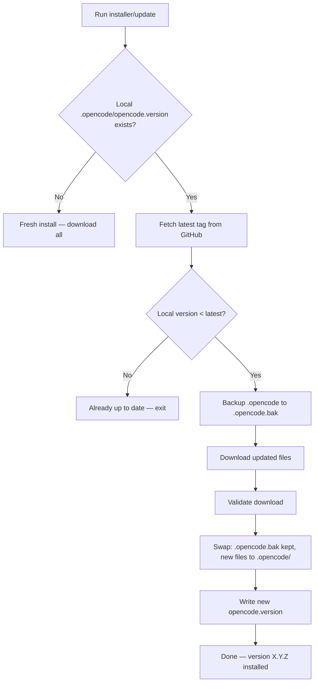

# TDD: OpenCode Self-Update Mechanism

## Objective & Scope

- **What:** Add version tracking and self-update capability to the existing OpenCode curl-to-bash installer, plus an OpenCode `/update` command.
- **Why:** The current installer has no update mechanism — users must manually re-run the full installer with no version awareness. This creates friction and risk of running outdated configuration rules.
- **File Target:** `specs/tdd-opencode-self-update.md`

## Proposed Technical Strategy

### Core Components

1. **`opencode.version`** — version file distributed with the installer, installed into `.opencode/`. Matches `package.json` version. Used to compare installed vs latest available.

2. **Enhanced `install-opencode.sh`** — add:
   - `--update` flag: checks local `.opencode/opencode.version` vs latest GitHub release tag, only downloads if newer
   - `--check` flag: compares versions and reports status, no download
   - Preserve existing `--force` overwrite behavior
   - Backup `.opencode/` before updating (`.opencode.bak/`)
   - Atomic update: download to temp, validate, then swap

3. **GitHub Releases** — this repo uses git tags for releases. The installer reads the latest tag via GitHub API (`/releases/latest`) or falls back to `package.json` version via GitHub Raw.

4. **OpenCode `/update` command** — `.opencode/commands/update.md` that:
   - Detects current version from `.opencode/opencode.version`
   - Fetches latest version from GitHub
   - Presents comparison to user
   - Asks for confirmation before updating
   - Executes the curl-to-bash installer with `--update`

### Version Comparison Logic



### Impacted Files

| File | Action |
|------|--------|
| `opencode.version` | **Create** — version file matching package.json |
| `generate-installer.sh` | **Edit** — add version file inclusion, `--update` and `--check` support |
| `dist/install-opencode.sh` | **Regenerate** — from updated generator |
| `installer.config` | **Edit** — add version-related config vars |
| `.opencode/commands/update.md` | **Create** — OpenCode command for self-update |
| `INSTALLER.md` | **Edit** — document update workflow |
| `AGENTS.md` | **Regenerate** — via `npm run opencode:compile` |

### Language-Specific Guardrails

- **Bash:** Use `set -euo pipefail` in all scripts. Validate downloads with exit code checks. Use `mktemp -d` for atomic operations. Clean up with `trap`.
- **Version comparison:** Use pure POSIX semver comparison function. No external dependencies beyond `curl` and standard tools.

## Implementation Plan

### Phase 1: Version Foundation

- Create `opencode.version` with current version (`1.2.0`)
- Update `installer.config` to add `VERSION_FILE` variable
- Update `generate-installer.sh` to embed version file in generated installer

### Phase 2: Installer Enhancement

- Add `--update` flag to installer:
  - Read local `.opencode/opencode.version`
  - Fetch latest release tag from GitHub API
  - Compare versions using `semver_compare()`
  - If newer: backup, download, validate, swap, update version file
- Add `--check` flag: version comparison only, no download
- Add backup mechanism (`.opencode.bak/`)
- Ensure atomic swap (download to temp, validate, move)

#### Pseudocode — `semver_compare()`

```bash
semver_compare() {
  local v1="$1" v2="$2"
  local IFS='.'
  read -ra a <<< "$v1"
  read -ra b <<< "$v2"
  for i in 0 1 2; do
    if (( 10#${a[i]:-0} < 10#${b[i]:-0} )); then echo "<"; return; fi
    if (( 10#${a[i]:-0} > 10#${b[i]:-0} )); then echo ">"; return; fi
  done
  echo "="
}
```

#### Pseudocode — `check_for_update()`

```bash
check_for_update() {
  local local_version latest_version
  if [[ -f "${TARGET_DIR}/opencode.version" ]]; then
    local_version=$(cat "${TARGET_DIR}/opencode.version")
  else
    local_version="0.0.0"
  fi
  latest_version=$(curl -sf "${GITHUB_API_URL}/releases/latest" | grep '"tag_name"' | cut -d'"' -f4 | sed 's/^v//')
  if [[ -z "${latest_version}" ]]; then
    latest_version=$(curl -sf "${RAW_URL}/package.json" | grep '"version"' | cut -d'"' -f4)
  fi
  if [[ "$(semver_compare "${local_version}" "${latest_version}")" == "<" ]]; then
    echo "UPDATE_AVAILABLE"
    return 0
  fi
  echo "UP_TO_DATE"
  return 0
}
```

### Phase 3: OpenCode Update Command

- Create `.opencode/commands/update.md`:
  - `mode: subagent`
  - `description: Check for updates and update OpenCode configuration`
  - Detects current version from `.opencode/opencode.version`
  - Fetches latest version from GitHub
  - Presents comparison to user
  - Asks for confirmation before updating
  - Executes the curl-to-bash installer with `--update`

### Phase 4: Documentation & Release

- Update `INSTALLER.md` with update instructions
- Regenerate `dist/install-opencode.sh` via `./generate-installer.sh`
- Run `npm run opencode:compile`
- Version bump via `/finish-task` → approval → `/release`